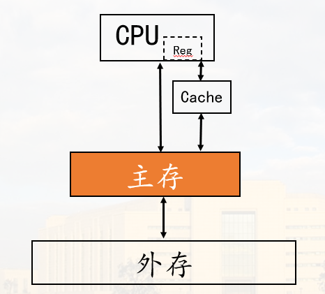

# 概论

- [概论](%E6%A6%82%E8%AE%BA.md#概论)
  - [冯·诺依曼计算机](%E6%A6%82%E8%AE%BA.md#冯诺依曼计算机)
    - [核心思想](%E6%A6%82%E8%AE%BA.md#核心思想)
    - [硬件组成](%E6%A6%82%E8%AE%BA.md#硬件组成)
    - [主要特点](%E6%A6%82%E8%AE%BA.md#主要特点)
    - [改进](%E6%A6%82%E8%AE%BA.md#改进)
  - [计算机系统的硬件组成](%E6%A6%82%E8%AE%BA.md#计算机系统的硬件组成)
    - [主要功能部件](%E6%A6%82%E8%AE%BA.md#主要功能部件)
      - [1. CPU](%E6%A6%82%E8%AE%BA.md#1-cpu)
        - [(1) 运算器](%E6%A6%82%E8%AE%BA.md#1-运算器)
        - [(2) 控制器](%E6%A6%82%E8%AE%BA.md#2-控制器)
        - [(3)本课程讨论](%E6%A6%82%E8%AE%BA.md#3本课程讨论)
      - [2. 存储器](%E6%A6%82%E8%AE%BA.md#2-存储器)
        - [(1)功能](%E6%A6%82%E8%AE%BA.md#1功能)
        - [(2)组成(主存储器为例)](%E6%A6%82%E8%AE%BA.md#2组成主存储器为例)
        - [(3)本课程讨论](%E6%A6%82%E8%AE%BA.md#3本课程讨论-1)
      - [3. 输入输出设备](%E6%A6%82%E8%AE%BA.md#3-输入输出设备)
    - [硬件系统结构(考虑部件间的信息传输方式)](%E6%A6%82%E8%AE%BA.md#硬件系统结构考虑部件间的信息传输方式)
      - [1. 以总线为基础的系统结构](%E6%A6%82%E8%AE%BA.md#1-以总线为基础的系统结构)
        - [(1)单总线结构](%E6%A6%82%E8%AE%BA.md#1单总线结构)
        - [(2)以CPU为中心的双总线结构](%E6%A6%82%E8%AE%BA.md#2以cpu为中心的双总线结构)
        - [(3)以存储器为中心的双总线结构](%E6%A6%82%E8%AE%BA.md#3以存储器为中心的双总线结构)
        - [(4)多级总线结构](%E6%A6%82%E8%AE%BA.md#4多级总线结构)
      - [2. 采用通道或IOP的大型系统结构](%E6%A6%82%E8%AE%BA.md#2-采用通道或iop的大型系统结构)
        - [(1)带通道的系统](%E6%A6%82%E8%AE%BA.md#1带通道的系统)
        - [(2)带IOP(IO处理机)的系统](%E6%A6%82%E8%AE%BA.md#2带iopio处理机的系统)
      - [3. 模型机系统结构](%E6%A6%82%E8%AE%BA.md#3-模型机系统结构)
      - [4. I/O接口](%E6%A6%82%E8%AE%BA.md#4-io接口)
      - [5. 本课程讨论](%E6%A6%82%E8%AE%BA.md#5-本课程讨论)
  - [计算机系统的性能指标](%E6%A6%82%E8%AE%BA.md#计算机系统的性能指标)
    - [1. 基本字长](%E6%A6%82%E8%AE%BA.md#1-基本字长)
    - [2. 运算速度](%E6%A6%82%E8%AE%BA.md#2-运算速度)
    - [3. 数据通路宽度与数据传输率](%E6%A6%82%E8%AE%BA.md#3-数据通路宽度与数据传输率)
      - [(1). 数据通路宽度](%E6%A6%82%E8%AE%BA.md#1-数据通路宽度)
        - [(2). 数据传输率](%E6%A6%82%E8%AE%BA.md#2-数据传输率)
    - [4. 存储容量](%E6%A6%82%E8%AE%BA.md#4-存储容量)
      - [(1). 主存容量](%E6%A6%82%E8%AE%BA.md#1-主存容量)
      - [(2). 外存容量](%E6%A6%82%E8%AE%BA.md#2-外存容量)
    - [5. 基准程序测试](%E6%A6%82%E8%AE%BA.md#5-基准程序测试)
      - [(1). 基准测试程序(Benchmark)](%E6%A6%82%E8%AE%BA.md#1-基准测试程序benchmark)
      - [(2) 基准测试程序套装(Benchmark Suite)](%E6%A6%82%E8%AE%BA.md#2-基准测试程序套装benchmark-suite)
  - [计算机发展](%E6%A6%82%E8%AE%BA.md#计算机发展)

## 冯·诺依曼计算机

### 核心思想

1. 采用二进制形式表示数据和指令
2. 采用存储程序方式工作（核心）
3. 硬件组成：运算器、控制器、存储器、输入设备、输出设备；并规定了这五大部件的基本功能

### 硬件组成

### 主要特点

以运算器为核心；指令串行执行

### 改进

* 并行处理技术
* 输入/输出控制方式
* 存储器组织方式
* 指令系统设计(精简、复杂)

## 计算机系统的硬件组成

### 主要功能部件

#### 1. CPU

执行指令: 产生控制信息, 控制各个部件工作

由运算器、控制器组成

##### (1) 运算器

1). 功能: 实现各类运算

2). 组成: 

##### (2) 控制器

1) 功能: 产生控制命令(微命令), 控制全机操作

2) 组成: 

3) 微命令产生方式(指令执行控制方式):

   a). 组合逻辑控制: 由组合逻辑电路产生微命令  
   b). 微程序控制: 由微指令产生微命令

##### (3)本课程讨论

* 运算器组织与工作原理
* 两种控制器组成原理与控制机制
* 模型机的数据通路结构和指令执行过程

#### 2. 存储器

##### (1)功能

存储程序与数据

##### (2)组成(主存储器为例)

存储体: 存放信息的实体
寻址系统: 对地址码译码,选择存储单元
控制线路: 产生读/写时序, 控制读/写操作
读/写线路: 完成读/写操作

##### (3)本课程讨论

* 半导体存储单元读/写原理
* 主存储器逻辑设计方法

#### 3. 输入输出设备

功能: 信息转换

### 硬件系统结构(考虑部件间的信息传输方式)

#### 1. 以总线为基础的系统结构

总线: 能为多个部件分时共享(同一时刻只有一个部件能发送信息)的一组信息传送线路及相应的控制逻辑

是效率和成本之间的折衷(相对比两两之间的线路)

##### (1)单总线结构

注意I/O与系统总线之间通过接口连接

缺陷:所有的部件都通过总线通信, 效率低

##### (2)以CPU为中心的双总线结构

CPU与存储器之间有单独的一条总线

缺陷:降低CPU的利用率(外部与存储器通信占用CPU)

##### (3)以存储器为中心的双总线结构

##### (4)多级总线结构

#### 2. 采用通道或IOP的大型系统结构

##### (1)带通道的系统

通道用于在主机与外设进行信息交换时节约CPU时间; CPU与通道并行工作

##### (2)带IOP(IO处理机)的系统

#### 3. 模型机系统结构

采用单总线系统结构

#### 4. I/O接口

系统总线与IO设备之间的交接部分称为IO接口  
外部设备通过IO接口连接系统总线, 与主机通信

#### 5. 本课程讨论

* IO控制方式
* 总线与接口的概念、功能、分类
* 中断方式及接口
* DMA方式及接口

## 计算机系统的性能指标

### 1. 基本字长

基本字长指参加一次运算的操作数的位数, 如8、16、32、64

字长影响计算精度、指令功能(操作码数量、类型)

### 2. 运算速度

CPU主频和时钟频率: 决定CPU内核工作速度的重要因素

MIPS: 每秒百万条指令数; M $\rightarrow$ 百万

FLOPS: 每秒浮点运算次数

CPI: 执行每条指令所需的时钟周期数

### 3. 数据通路宽度与数据传输率

#### (1). 数据通路宽度

指数据总线一次能并行传送的数据位数

#### (2). 数据传输率

指数据总线每秒传送的数据量(字节), 也称为带宽

计算公式:  
$总线带宽 = \frac{总线数据通路宽度 \times 总线时钟频率}{8}(Bps)$

### 4. 存储容量

#### (1). 主存容量

容量:  
$容量 = 主存单元个数 \times 主存单元的位数$

#### (2). 外存容量

常表示为字节数

与地址码位数无关

### 5. 基准程序测试

#### (1). 基准测试程序(Benchmark)

* 实际应用程序
* 核心测试程序
* 小测试程序
* 合成测试程序
* ......

#### (2) 基准测试程序套装(Benchmark Suite)

SPEC2006, 2017, ......

## 计算机发展

略啦, 看PPT啦 (～￣▽￣)～
