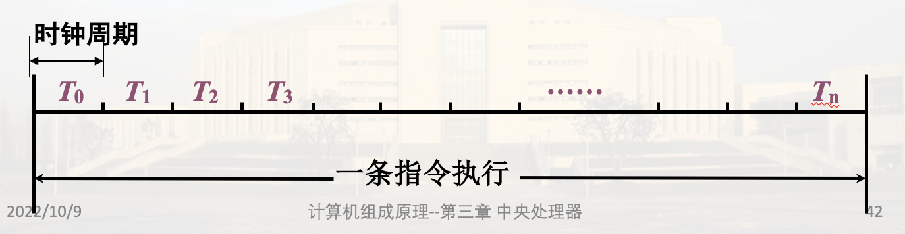

# 模型机的总体设计

## 模型机指令系统

模型机指令格式分类:

1. 双操作数指令
2. 单操作数指令
3. 转移指令

### 1. 指令格式

采用定长格式, 指令字长16位

#### (1) 双操作数指令

#### (2) 单操作数指令

#### (3) 转移类指令

### 2. 寻址方式

操作数在寄存器或存储器中

模型机主存储器按字编址, 字长16位

为了减少地址码长度, 采用寄存器型寻址, 地址码部分给出的是寄存器号

**常用寻址方式如下**:

这边的立即数(011的(PC)+)中的立即数存在当前指令的下一个存储单元, 故通过PC取立即数, 之后PC+1正确指向下一条指令

### 3. 按功能划分的指令类型

操作码共4位, 设置15种(14种编码, 转移指令与子程序返回指令共用一种编码)

余下两种编码可供指令扩充

    传送指令：一种
    双操作数算逻指令：五种
    单操作数算逻指令：六种
    程序控制类指令：三种，其中两种操作码相同

RST返回地址隐含在堆栈顶

## 模型机CPU组成

* 运算器: 输入选择器/锁存器$\rightarrow$ALU$\rightarrow$移位器
* 寄存器: 暂存参与运算的数据或运算结果
* 控制器: 组合逻辑控制器/微程序控制器
* 总线(数据传送通路): CPU内总线、系统总线
* 时序系统: 产生时序信号, 控制分步操作

### 1. 运算器

#### (1). 输入选择器

#### (2). ALU(算数逻辑单元)

采用SN74181芯片(4位)

由微命令M，C0，S0，S1，S2，S3控制不同运算(逻辑、算数运算, 进位规则等)

#### (3). 移位器

直接传送, 左移 或 右移

### 2. 寄存器设置 IMPORTANT

16位, 内部由16个边沿D触发器或集成D触发器构成

同步打入(受CP控制)或异步置入(优先级更高)

#### (1). 用于暂存数据的寄存器: 通用寄存器、暂存器

##### ① 通用寄存器组

可编程, 指令系统种分配了编号: `R0、R1、R2、R3`

##### ② 暂存器

不可编程, 暂存信息, 指令系统种没有分配编号, 故不可能出现在用户程序中

暂存器C: 用于暂存从主存中读取的源操作数或源操作数地址

暂存器D: 用于暂存从主存中读取的目的地操作数数或目的地操作数地址

#### (2). 用于程序控制的寄存器

##### ① 指令寄存器IR 采取异步置入方式)

用来存放现行运行指令, 可扩充为指令队列(指令栈)(效率更高)

##### ② 程序计数器PC

提供下一条指令的地址

##### ③ 程序状态字寄存器PSW(Program Status Word)

特征位(不可编程): 进位C(Carry), 溢出O(Overflow), 零值Z, 负数N  
控制位(可编程): 允许 中断I 等  

#### (3) 主存接口寄存器

##### ① 地址寄存器MAR (单向)

访存时, CPU先将地址信息送入MAR, 再由MAR经地址总线送往主存储器, 找到相应的主存单元

包括双间接访存也得这样

##### ② 数据缓冲寄存器MDR (双向)

CPU与总线、寄存器等交换都经过它

由控制命令R/W决定传送方向

### 3. 控制器

指令执行过程中, 分时产生每一步操作需要的控制信号(微命令)

### 4. 总线

#### (1) CPU内总线

单项数据传送总线, 分离寄存器结构(每个寄存器看成单独的存储单元)

注意箭头表示数据传输方向, 寄存器无法向内部总线输入, 需要先从选择器转一圈, 寄存器到寄存器也得这样绕一圈

注意这里讲的是模型机的总线设计

控制简单, 连线少, 效率低

#### (2). 系统总线

通过16位系统总线连接主存和外设系统

IMPORTANT

其中

* AB: 地址总线
* DB: 数据总线 ; 要从M读数据: M$\rightarrow$MDR$\rightarrow$选择器$\rightarrow$指定存储单元, 其他同理, 都得经过MDR(除了CPU内的数据交换); 注意从M读间址单元的地址(双间址方式)还是MDR(虽然是地址信息, 但是CPU本质上并不知道这是个地址), MAR只能从CPU到系统总线
* CB: 控制总线

### 5. 时序系统

计算机的工作通常是分步执行，需要有一种时间信号作为分步执行的标志

模型机的时序信号包含机器周期(工作周期)、时钟周期(节拍)、脉冲
> 机器周期(工作周期): 表明一个阶段的工作(取址、取数、执行、写结果), 时间长度是时钟周期的倍数  
> 时钟周期(节拍): 对一个阶段的工作的划分(例如一节大课分成两个45分), 一般时间长度固定  
> 脉冲: 对应一个时间点  

产生时序信号的部件称为时序发生器或时序系统，它由一个振荡器(产生脉冲)和一组计数分频器组成

## CPU的数据通路结构

### 1. 模型机数据通路框图

注意SP PC只连接到选择器A; PSW MDR连接到选择器B, 其中MDR还与数据总线相连

### 2. 各类信息的传送路径

指令执行过程就是各类信息的传递

* 指令信息: 从主存M到指令寄存器IR
* 地址信息: 包括指令地址和数据地址(都对应存储单元)
* 数据信息: Ri $\rightarrow$ Rj(都在CPU内, 不经过系统总线), R $\rightarrow$ M/接口(经过MDR), M/接口 $\rightarrow$ R(经过MDR)

#### (1). 取指令地址

MAR通过三态门与地址总线连接

注意PC要+n, 模型机假定n为1(一条指令固定一个字)

#### (2). 指令信息的传送

异步置入指各触发器的异步置位, 这样速度更快(不用等脉冲)

#### (3). 操作数地址

根据寻址方式，若操作数在存储器中，则需按寻址方式计算操作数地址，送入地址寄存器MAR

寄存器直接寻址不再介绍取地址方法

##### ① 寄存器间址(R)

.png)

##### ② 自减型寄存器间址-(R)

.png)

注意是一次性写进Ri和MAR

##### ③ 自增型寄存器间址(R)+

+.png)
注意取了两次Ri, 第二次是为了更改Ri

##### ④自增型双间址@(R)+

第一次读Ri是为了读间址单元里的数据(操作数的地址)
第二次读Ri为了改变Ri
为什么还要C暂存操作数地址, 而不是直接送到MAR: 为了硬件简化-多种取地址方式的统一

##### ⑤. 变址寻址X(R)

#### (4) 数据信息的传送

##### 1. R $\rightarrow$ R

##### 2. R $\rightarrow$ M

仅限模型机: 注意不是异步, 一般在一个时钟周期的末尾

##### 3. M $\rightarrow$ R

这里是异步, 效率更高

没有标识的情况下采取同步方式

##### 4. M $\rightarrow$ M

M 到 CPU 内时, 想再写回主存, 可能在获取目的地地址时占用MDR, 故数据无法仅停留在MDR, 需到寄存器内暂存

##### 5. R $\rightarrow$ interface

##### interface $\rightarrow$ R

## 时序控制方式

### 1. 同步控制方式

各项操作与统一的时序信号同步, 称为同步控制

时间分配(基本特征): 将操作时间划分为多个时钟周期, 周期长度固定, 每个时钟周期完成一个操作

同步定时: 有些操作需要严格地同步定时，如 将结果打入寄存器，需要同步打入脉冲(8个一位之类的)

各部件之间的协调: 在CPU内，一般由CPU提供统一时序信号控制部件间信息传送

> 例如，CPU读存储器操作过程中，发地址码与从存储器接收数据操作的同步
> 

特点: 时序关系比较简单, 控制简单; 时间安排不经济

### 2. 异步控制方式

各项操作按需要选择不同的时间, 不受时钟周期的约束; 各操作之间的衔接与各部件之间的信息采取应答方式

时间分配(基本特征): 没有统一的节拍划分与同步定时脉冲，但存在着申请、响应、询问、回答一类的应答关系

> 如读数据与写入寄存器的异步控制
> 

特点: 时间紧凑，能按实际需要分配时间,实现异步应答所需的控制比较复杂

### 3. 实际应用中的变化

在CPU或设备的内部普遍采用同步控制方式

对连接CPU、主存、外设的系统总线，有的采用同步，有的采用异步控制，但多采用异步控制

在实际应用中，同步控制可以引入异步应答关系
