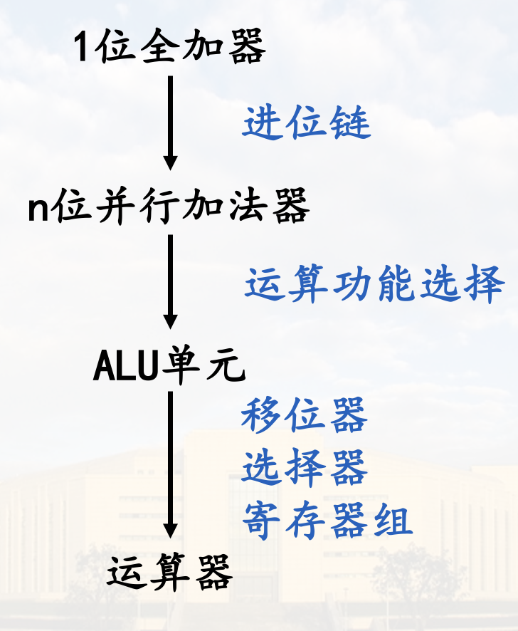
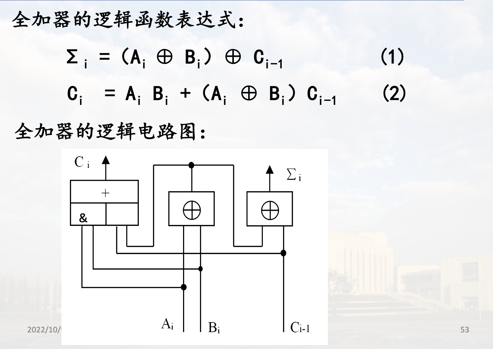
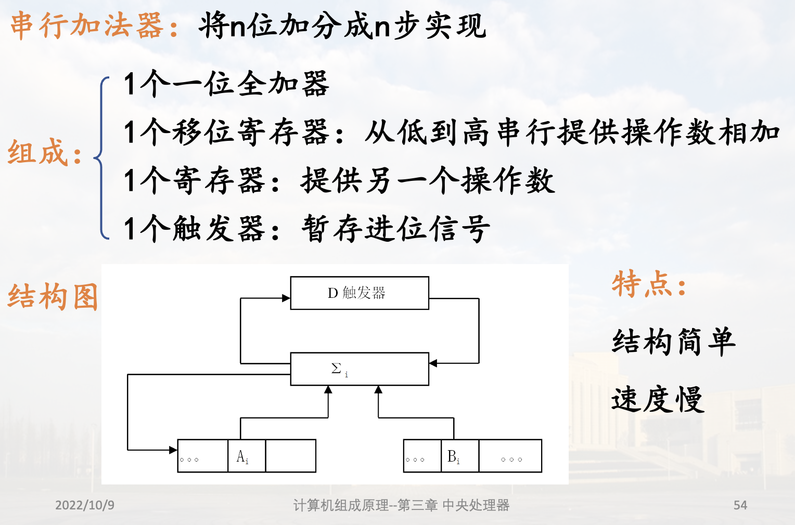
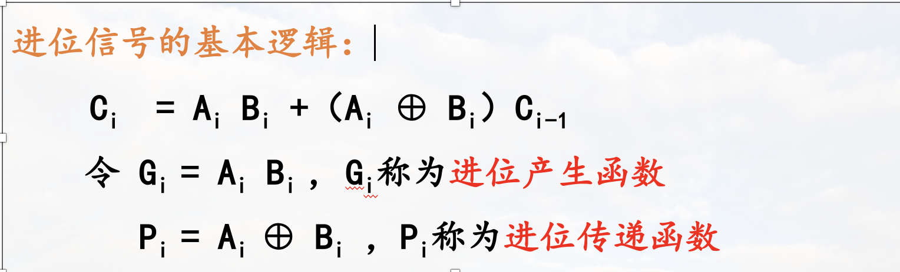
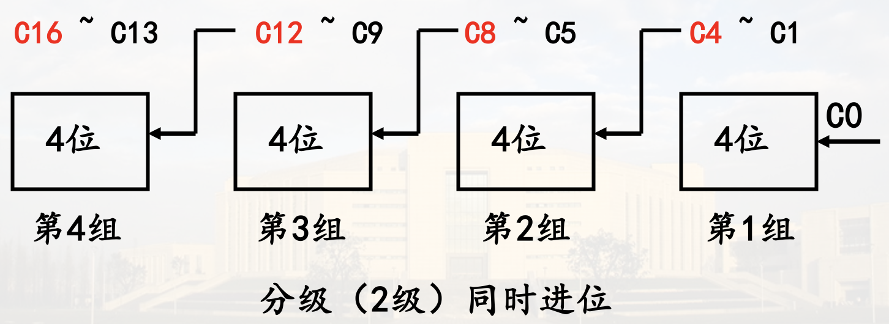
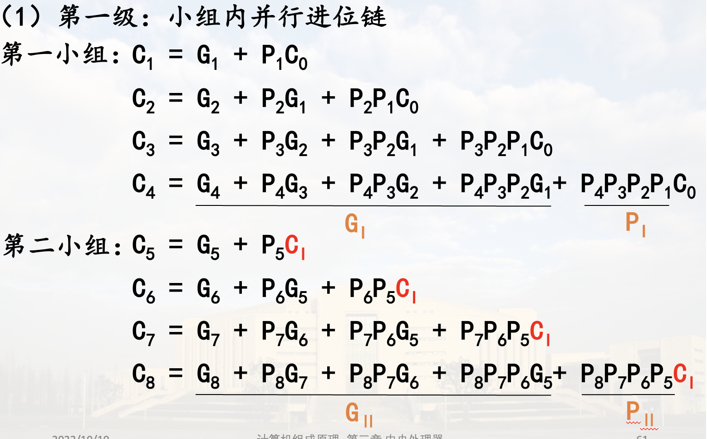
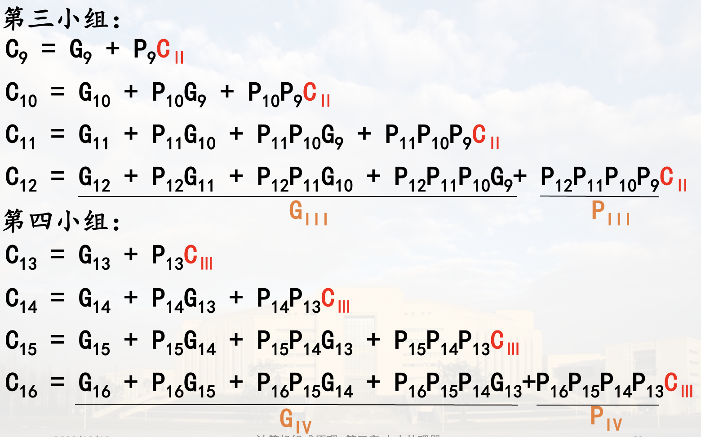
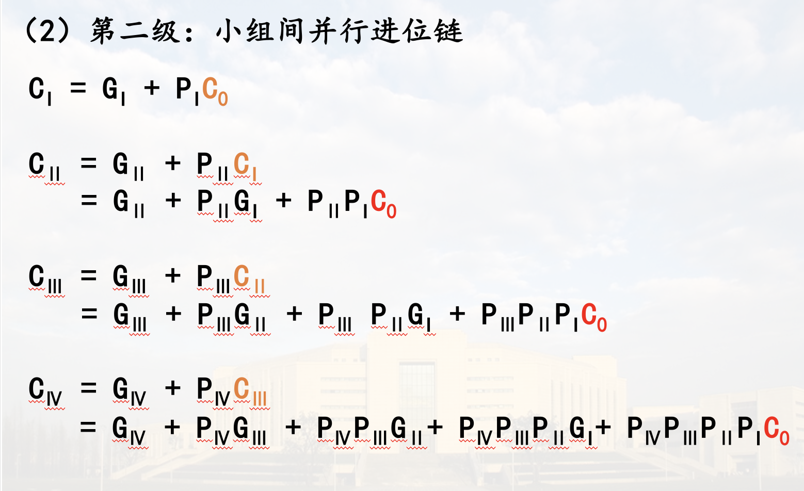
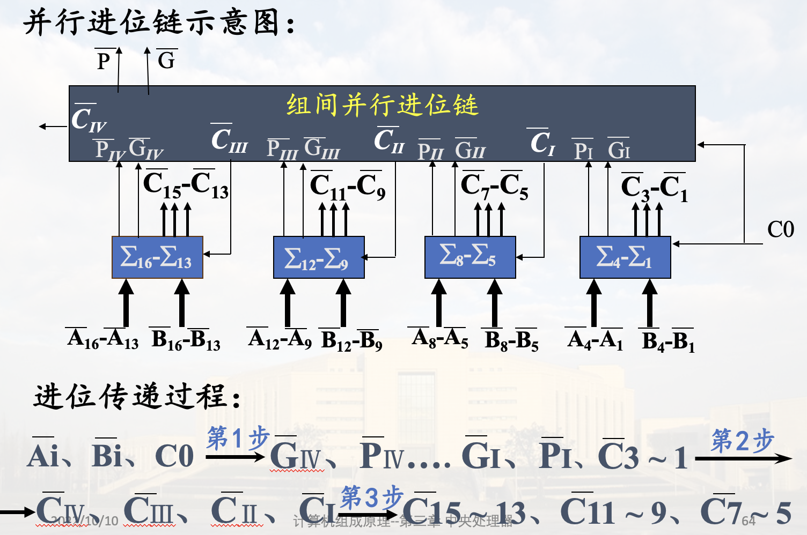
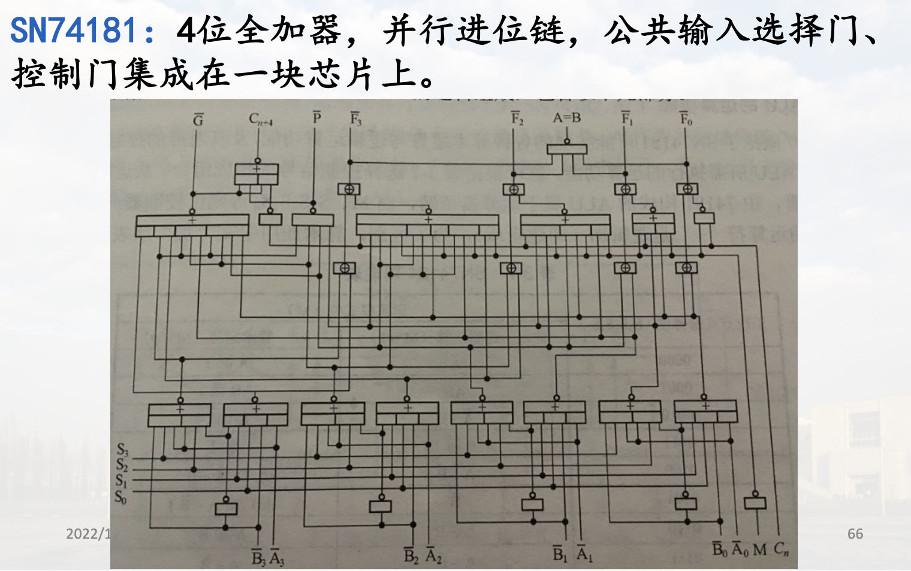

# 运算部件与运算器

## 1位加法单元

## 串行加法器

将n位加分为n步实现

## 并行加法器

用n位全加器一步实现n位相加

加法器的运算速度不仅与全加器的运算速度有关, 更主要的因素取决于进位传递速度

### 1. 串行进位链

### 2. 并行进位链

> 

### 3. 分组进位

组内并行, 组间并行/串行

> 加法器字长16位，设4位为一组，则将进位链分为两级
> 
> 下面是组间并行
> 
> 
> 
> 

## ALU(算数逻辑单元)

### 1. 一位ALU

加法器 输入选择器 控制门

$S0 - S3$: 控制信号
$\overline Ai 、 \overline Bi$: 输入信号
$M$: 限制$C_{i-1}$进位信号, 控制运算为逻辑或算数运算

### 2. 四位ALU芯片例

$+$为算数加, $⊕$为逻辑加

## 运算器组织

基本组成: ALU 寄存器组 判别逻辑

问题:

1. 提供操作数的方式
2. 寄存器组的结构
  独立寄存器结构: (输入选择不需要暂存) In 模型机  
  小型存储器结构: 取数据的次数  
    单口(输入选择需要暂存)  
    双口(不需暂存)  

带多路选择器的运算器

