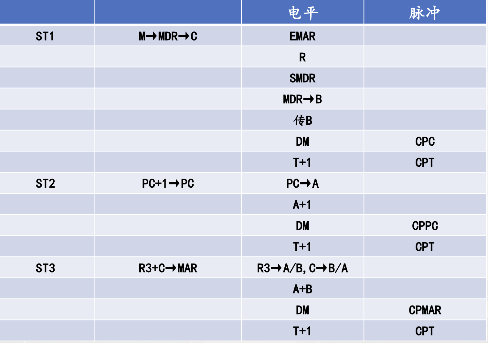
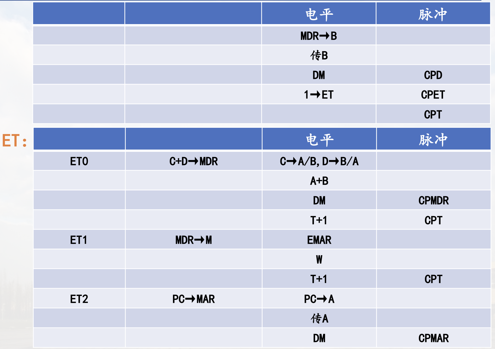
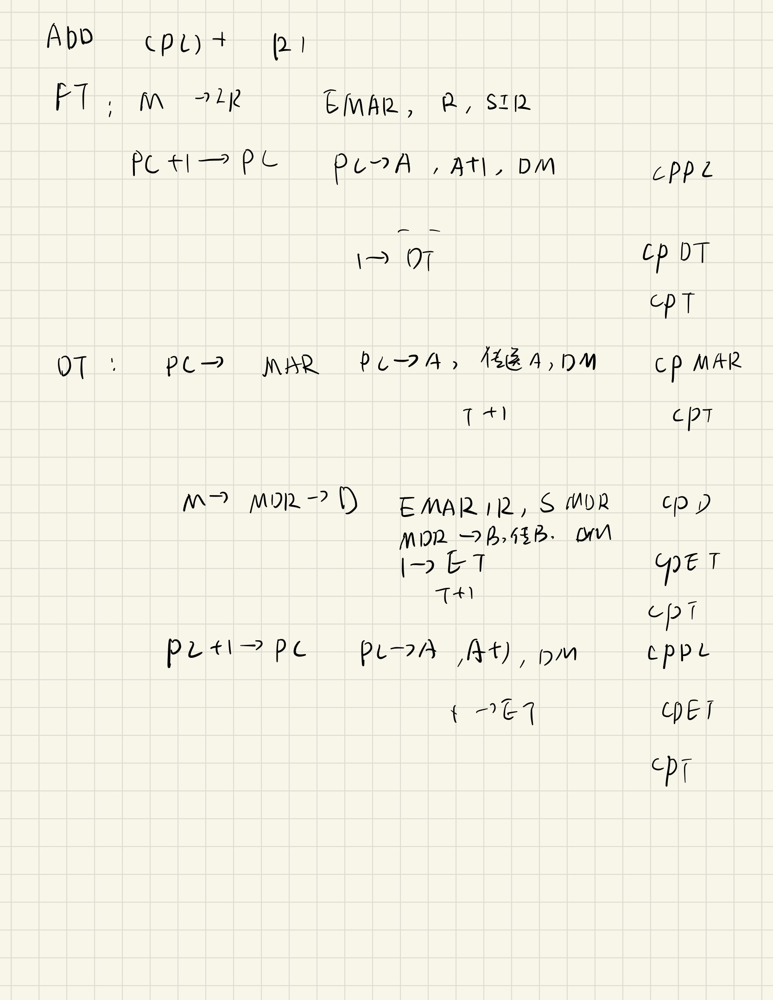

# 模型机的组合逻辑控制器

## 组合逻辑控制器概述

定义: 组合逻辑控制器的微命令是由组合逻辑电路实现。每种微命令都需要一组逻辑电路，全机所有微命令所需的逻辑电路就构成了微命令发生器

硬件组成: 

## 组合逻辑控制器时序系统

模型机的组合逻辑控制器采用三级时序:
工作周期（机器周期）、时钟周期（节拍）、工作脉冲  
依靠不同的时间标志，使CPU分步工作

### 三级时序

#### 工作周期

在指令周期中的某一工作阶段所需的时间，
称为一个工作周期。不同工作周期长度可能不同

#### 时钟周期

是时序系统中最基本的时间分段。各节拍的长度相同

#### 工作脉冲(定时脉冲)

有的操作如打入R，还需严格的定时脉冲，以确定在哪一刻打入

### 1. 工作周期

黄色: 必定经过
黑色: 可能经过

#### 1. 取址周期FT

从存储器取指令送IR, 并修改PC

#### 2. 源周期ST

源操作数非寄存器取址($\overline R$), 进入ST, 按寻址方式形成源操作数地址, 从主存读取送C

#### 3. 目的周期DT

目的操作数非寄存器寻址，则进入DT，按寻址方式形成目的地址送MAR，非传送类指令还需从主存读操作数送D

#### 4. 执行周期ET

根据操作码执行具体操作（传送、运算、转移等），并**将后续指令地址(PC的值)送MAR**

#### 5. DMA周期DMAT

响应DMA请求之后进入DMAT，实现主存与外围设备间的数据直传

#### 6. 中断周期IT

响应中断请求后需要一个过渡周期，为进入中断服务程序做准备，这个过渡周期称为中断周期IT

#### 工作周期转换

注意可能有多个DMAT, 但只有最多一个IT

##### 工作周期转换的控制

每个 工作周期 对应一个状态触发器(0 $\rightarrow$ 1 工作状态开始; 1 $\rightarrow$ 0 工作状态结束), 采用集成D触发器

同一时刻, 只能有一个工作周期状态触发器为1, 指明当前所在工作周期(每个工作周期都有一个对应的状态触发器)

### 2. 时钟周期(节拍)

控制一个工作周期内的分步操作

#### (1) 时钟周期长度

模型机以一次访存时间作为时钟周期的长度, 设置为1us, 可执行操作如下

* 一次读主存, 并经过内部数据通路传送的操作(异步, 于是一次就行)
* 一次内部数据通路传送操作
* 一次写主存操作(MDR $\rightarrow$ M)(内部数据传到MDR采用同步方式, 故此时钟周期无法继续向主存传数据)

#### (2) 时钟周期计数

一个工作周期内可以包含多个时钟周期

用计数器T进行计数

> 如@(R0)+ (部分步骤省略)  
> 1 R0 $\rightarrow$ MAR  
> 2 R0 $\rightarrow$ ALU(+1) $\rightarrow$ R0  
> 3 M $\rightarrow$ C  
> 4 C $\rightarrow$ MAR  
> 5 M $\rightarrow$ MAR  

### 3. 工作脉冲 P

每个时钟周期的末尾设置一个工作脉冲, 作为各种同步脉冲的来源

同步定时脉冲控制定时操作: 打入寄存器(及写结果)(前沿, 上升沿), 时序切换(后沿, 下降沿)

## 指令流程与操作时间表 IMPORTANT

CPU执行指令的工作机制, 从两个层次分析

### 1. 指令流程

在寄存器传送级拟定各类指令的执行流程, 即每一时钟周期完成的具体操作

> 取指令: M $\rightarrow$ DB $\rightarrow$ IR, 化简为寄存器传送级: M$\rightarrow$IR
> 数据传送: R0 $\rightarrow$ 选择器A $\rightarrow$ ALU $\rightarrow$ 移位器 $\rightarrow$ 内总线 $\rightarrow$ R1, 化简为寄存器传送级: R0 $\rightarrow$ R1

### 2. 操作时间表

指令流程中各操作所需的微操作命令(电位型、脉冲型)序列, 以及各种微命令的逻辑条件和实践条件

#### ☆ CPU内部数据通路操作(R之间的数据传送)相关微命令

##### 1. ALU输入选择

* Ri $\rightarrow$ A (选择寄存器Ri):
Ri取值：R0、R1、R2、R3，C, D, PC, SP

* Rj $\rightarrow$ B (选择寄存器Rj):
Rj取值：R0、R1、R2、R3, C, D, MDR, PSW

##### 2. ALU功能选择

S0, S1, S2, S3, C0(初始进位), M(算术/逻辑运算)

> 例: $S_3 S_2 S_1 S_0 \overline M C_0$ 不要求记住各组合对应的 ALU 操作

##### 3. 移位器功能选择

直传(DM)、左移(SL)、右移(SR)

##### 4. 结果分配微命令

脉冲型(CP开头)(同步)，脉冲上升沿将内总线上数据打入寄存器
CPR0、CPR1、CPR2、CPR3、CPC、CPD、CPMAR、CPPC、CPSP、CPMDR、CPPSW

#### ☆ 访问主存有关的微命令

##### 1. 读主存

* EMAR (地址使能微命令, 有效时 MAR 到数据总线的三态门打开)(Enable MAR)
* R (读存储器微命令)(Read)
* SMDR (MDR 置入微命令(异步), 数据从主存经数据总线置入 MDR)
* SIR (IR 置入微命令, 取指令时指令从主存经数据总线置入 IR)

根据工作周期ST/DT还是FT确定采用哪条微命令

##### 2. 写主存

* EMAR
* W(写主存微命令)(Write)

#### ☆ 时序切换微命令

* CPT(每一个时钟周期结束时钟周期计数器计数及清零)
* 1 $\rightarrow$ ST(设置状态触发器ST的D端, 置1), ......(其他状态触发器控制)
* CPST(状态触发器的CP端(时钟信号)), ......(其他状态触发器控制)(与上面那个成对使用)

### 具体设计

#### 1. 取址周期 FT

##### (1) 进入 FT 的方式和条件

由S端异步置入: 此时时钟周期信号还不稳定(具体见图)

CPFT: 相对正常的脉冲取了个反, 后沿(原为下降沿)

##### (2) 取址流程

FT0(FT的第一个时钟周期$T_0$): M $\rightarrow$ IR, PC + 1 $\rightarrow$ PC (上面两段路径不重叠, 可以同步进行)

##### (3) 操作时间表

到此取址结束, 下面是时序切换

下面是工作周期切换, 不同分支, 产生条件在每条微指令的后面以中括号标识, 下面图中第二条微指令的产生条件省略

* 
* 
* 

#### 2. 传送类指令

注意(R)+, 对Ri的更改放在读M后面, 这是为了在源周期的相同时钟周期内(ST1), 进行相同的操作, 但顺序对结果没有影响; 其他的操作同理

##### (1) (R)型

%E5%9E%8B.png)

##### (2) -(R)型

.png)

##### (3) I/(R)+型

+.png)

##### (4) @(R)+

+.png)
+2.png)

##### (5) X(R)+

.png)
2.png)

##### 设计原则

同一时钟周期内，操作内容尽量相同，以便化简微命令时间条件，简化硬件设计

##### 目的周期指令流程

相对上面的源周期指令, 没有送暂存寄存器C的流程(因为不取数, 只准备地址);

##### 执行周期指令流程

因为在源周期及目的周期(如果有)都准备好数据/地址了, 于是直接读/写

目的地是非寄存器, 多一次写M的流程

注意最后一个节拍 PC送MAR

##### 示例

1. 写出指令流程`MOV R0 R1`:
    > FT0: M $\rightarrow$ IR, PC + 1 $\rightarrow$ PC
 
    > ET0: R1 $\rightarrow$ R0  
    > ET1: PC $\rightarrow$ MAR

2. `MOV (R0) X(R1)`
    > FT0: M $\rightarrow$ IR, PC+1 $\rightarrow$ PC
 
    > ST0: PC $\rightarrow$ MAR  
    > ST1: M $\rightarrow$ MDR $\rightarrow$ C(形式地址)  
    > ST2: PC+1 $\rightarrow$ PC  
    > ST3: R1 + C $\rightarrow$ MAR  
    > ST4: M $\rightarrow$ MDR $\rightarrow$ C(源操作数)
 
    > DT0: R0 $\rightarrow$ MAR
 
    > ET0: C $\rightarrow$ MDR  
    > ET1: MDR $\rightarrow$ M  
    > ET2: PC $\rightarrow$ MAR

#### 3. 双操作数指令

目的周期需要取目的操作数送D

执行周期根据操作码执行具体操作

##### 例子

`ADD @(R1)+ X(R3)`

`ADD (PC)+ R1`

#### 4. 单操作数指令

##### 例子

`COM -(RO)`(按位取反)

FT0: M $\rightarrow$ IR, PC+1 $\rightarrow$ PC  
DT0: R0-1 $\rightarrow$ R0, MAR  
DT1: M$\rightarrow$ MDR $\rightarrow$ D  
ET0: $\overline{D}$ $\rightarrow$ MDR  
ET1: MDR $\rightarrow$ M  
ET2: PC $\rightarrow$ MAR

#### 5. 转移/返回指令(共用操作码)

* `JMP` 获取转移地址, 安排在ET中
* `RST` 获取返回地址(来自栈顶), 安排在ET中

`JMP`执行结果有两种  

* `JP` 转移条件满足, 转移  
* `NJP` 转移条件不满足, 不转移, 顺序执行
  * $PC$型, 转移地址在当前指令下一个单元(为了顺序执行, PC要+1)  
  * $\overline{PC}$型, 转移地址不在当前指令下一个单元

> SKP: 跳步, 转移地址在下一个单元  
> `JP` $\rightarrow$ `(R)+`方式中, 当`R`为`SP`时, 对应`RST`操作  
> 注意变指寻址的差异, PC不用再加一

##### 例子

`JMP R0`

FT0: M $\rightarrow$ IR, PC+1 $\rightarrow$ PC  
ET0: R0 $\rightarrow$ PC, MAR

`RST (SP)+`(显式提供堆栈地址)

FT0: M $\rightarrow$ IR PC+1 $\rightarrow$ PC  
ET0: SP $\rightarrow$ MAR  
ET1: M $\rightarrow$ MDR $\rightarrow$ PC, MAR  
ET2: SP + 1 $\rightarrow$ SP  

> PC 送 MAR 在转移类指令不再需要

#### 6. 转子指令 `JSR`

注意在FT内PC已指向下一条指令

子程序内通过RST返回

> `JSR(R2)`  
> FT0: M $\rightarrow$ MAR, PC + 1 $\rightarrow$ PC  
> ST0: R2 $\rightarrow$ MAR  
> ST1: M $\rightarrow$ MAR $\rightarrow$ C  
> ET0: SP-1 $\rightarrow$ SP MAR  
> ET1: PC $\rightarrow$ MDR  
> ET2: M $\rightarrow$ M  
> ET3: C $\rightarrow$ PC MAR  

## 微命令综合与化简

归纳所有指令执行过程所需微命令，列出微命令与输入信号之间的逻辑关系，并综合化简

### 优化思路

* 提取公共逻辑变量，减少引线和元件数目，降低电路冗余
* 减少逻辑门级数，减少时延

### 电路实现

* 可直接用基本门电路、复合门电路实现，构成控制器的主要实体
* 也可用PLA(可编程逻辑阵列)实现

## 组合逻辑控制方式的优缺点

### 优点

控制信号产生速度快

### 缺点

* 设计不规整：实现各微命令的门电路所需逻辑形态不规整，核心电路繁琐、零乱，设计效率较低
* 不易修改或扩展：设计结果用印制电路板（硬连逻辑）固定下来以后，不便于修改或进行功能扩展

## 小结

1. 组合逻辑控制器：直接由硬连逻辑产生微命令
2. 三级时序：工作周期、时钟周期(节拍)和工作脉冲
3. 指令流程：每个时钟周期的具体操作(寄存器传送级,重点是传送类、双操作数指令）
4. 操作时间表：指令执行过程每一步的微命令序列，及各微命令的产生条件
5. 组合逻辑控制器的优缺点
