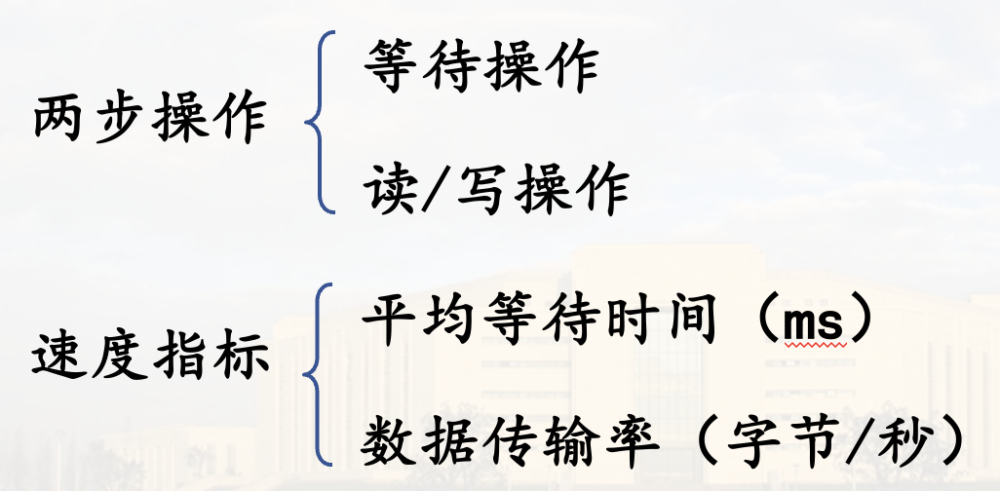
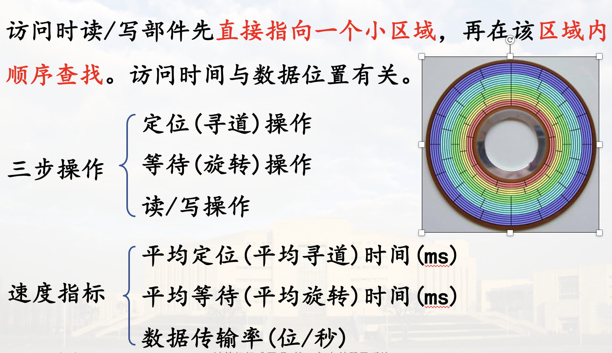

# 概述

## 存储子系统的层次结构

存储器是用来存放大量数据与程序的计算机部件

对存储器的基本要求: 容量大 速度快 成本低

因存储器与CPU的工作速度不匹配, 造成了计算机的“瓶颈”问题

* 解决瓶颈的方法:
  1. 改进制造工艺, 寻求新的存储机理
  2. 采用分层结构满足对系统结构的不同方面的需求  
    典型三级存储结构: 高速缓存(Cache)--主存--缓存  

### 1. 主存储器

能由CPU直接编程访问，存放当前CPU需要执行的程序与需要处理的数据

特点：存取速度较快，容量有限

对主存储器的基本要求：  

  1. 随机访问
  2. 工作速度快
  3. 具有一定的存储容量

### 2. 外存储器

存放需要联机保存、但暂不使用的大量程序与数据

特点：速度较慢，容量很大、成本低

程序与数据只有进入主存才能真正运行，外存储器用作后援

### 3. 高速缓存

存放即将要使用的程序与数据，作为主存中当前活跃信息的副本

特点：速度最快，容量很小，成本高

有效缓解访存的瓶颈问题

> 比如缓存指令、数组之类

现在可以进一步分成 L1、L2、L3, 分别在CPU内、外, 容量从小到大, 速度从快到慢

## 存储器按存储介质分类

### 1. 半导体存储器

由集成电路工艺制成各种存储芯片,用作主存等

静态: 存储器上的信息不需要刷新  
动态: 存储器上的信息需要刷新  

### 2. 磁表面存储器

利用磁层上不同方向的磁化区域表示信息  
容量大，速度慢，主要用作外存  
非破坏性读出(相比半导体)，长期保存信息(非易失)  
> 磁卡、磁鼓、磁带、磁盘等  

### 3. 光盘存储器

利用光斑的有无表示信息  
容量很大，非破坏性读出，长期保存，速度慢，作外存  

1. 只读型光盘（CD-ROM）  
2. 写入式（只能写一次）光盘（WORM）  
3. 可擦除/重写型（可逆式）光盘  

## 存储器按存取方式分类

### 1. 随机访问存储器 (RAM: random access memory)

#### 特点

1. 可按地址随机地访问任一存储单元
2. 访问各存储单元所需时间相同，与地址无关

#### 速度指标

存取时间：启动读/写操作到完成该操作所需时间  
存取周期：连续两次独立访存所需的最小时间间隔(比存取时间大一点)

用作主存、高速缓存

随机访问存储器根据读写特性分类

### 2. 顺序访问存储器 (SAM: sequential access memory)

信息按顺序存放，访问时间与信息存放位置有关  
磁带是采取顺序存取方式的存储器  

### 3. 直接访问存储器 (DAM: direct access memory)

磁盘、光盘是典型的DAM

访问时读/写部件先直接指向一个小区域，再在该区域内顺序查找。访问时间与数据位置有关

