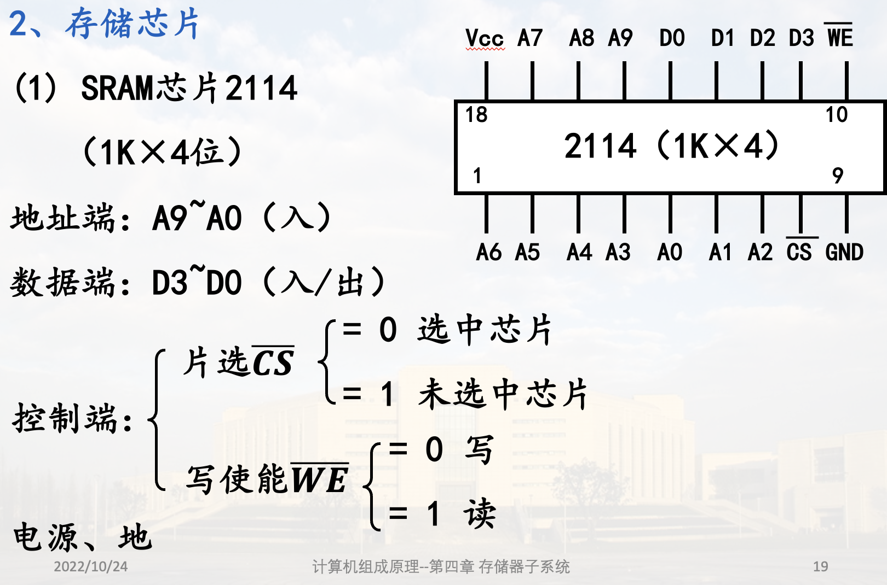
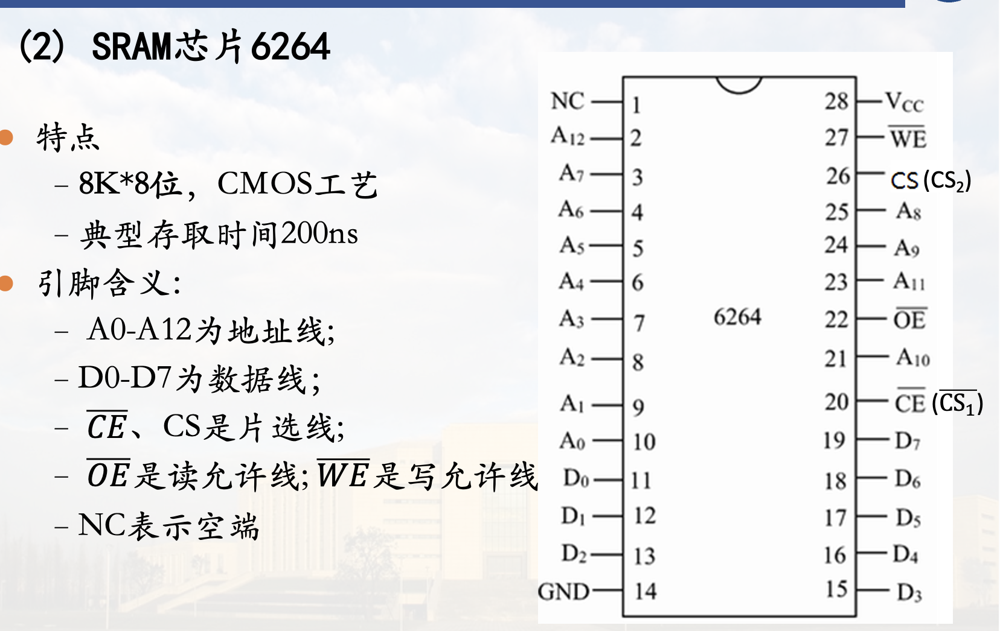
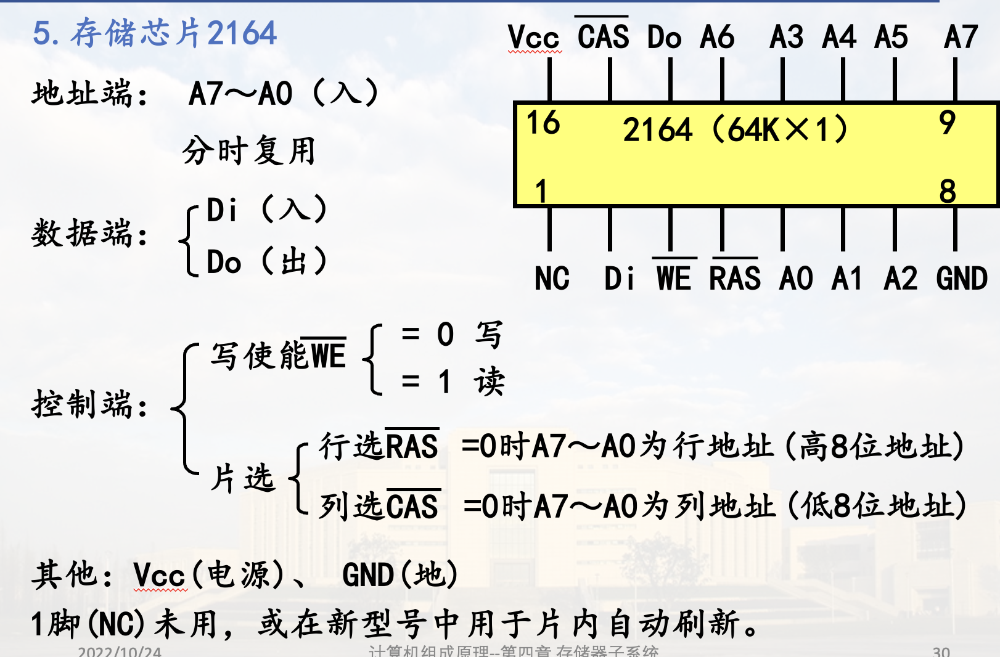

# 半导体存储原理

## 存储元

存储元: 能够表示一位二进制的"0"、"1"两种状态，且具有记忆功能的物理器件

存储单元: 若干存储元构成的一个存储单元

按信息存储原理分类

1. 静态存储元SRAM(静态MOS型), 不需刷新  
2. 动态存储元DRAM(动态MOS型), 需要刷新  

## 静态MOS存储元与芯片 (SRAM)

### 1. 六管单元电路结构(存储元)

依靠**双稳态电路**内部交叉反馈的机制存储信息

存0: $W$ 高电平, $\overline{W}$ 低电平  
存0: $W$ 低电平, $\overline{W}$ 高电平

有VCC, 功耗较高

### 2. 存储芯片

#### (1) SRAM芯片2114

$1K \times 4$: 1K个编址单元, 每个4b

地址端: 接地址总线

数据端: 接数据总线

#### (2) SRAM芯片6264

## 动态MOS存储元与芯片 (DRAM)

### 1. 基本存储原理

依靠电容存储电荷的原理存储信息

### 2. 动态存储元刷新

电容存在泄漏通路，电容上的电荷通过泄漏电路放电，使存储的信息丢失  
为此，每隔一定时间后就需要对存1的电容重新充电，称为刷新

### 3. 四管单元电路 (存储元)

无VCC, 功耗较低

0、1与W的关系同六管单元

### 4. 单管单元电路

W预充电: 到C的高低电平之间

### 5. 存储芯片2164

分时复用: 两次地址数据传送一个地址
