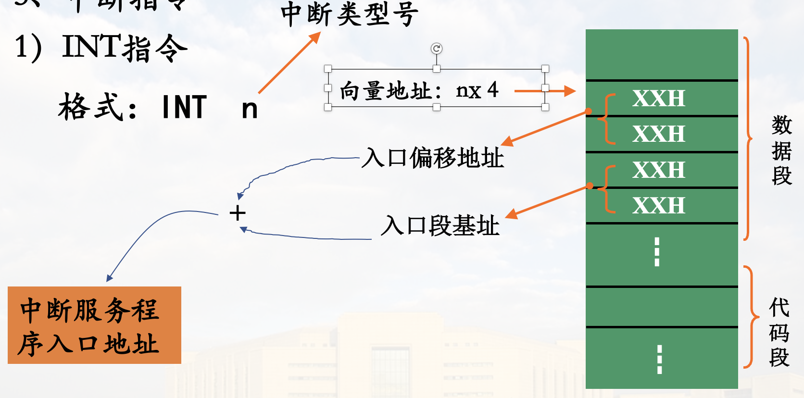

# 指令系统

常用符号说明

|符号|说明|
|---|---|
|OPRD|泛指操作数|
|REG|寄存器操作数|
|mem|存储器操作数|
|acc|累加器(`AX AL`)操作数|
|dest|目标操作数|
|src|源操作数|
|disp|8/16位偏移量, 可以是符号地址|
|DATA|8/16位立即数|
|PORT|输入输出端口号|
|[ ]|存储器操作数, 括号内为偏移地址|

## 一. 数据传输指令

### 1. 通用数据传送

**特点:** <font color=red>该类指令的执行对标识位不产生影响</font>

#### 1) 一般数据传送指令

格式: `MOV dest src`

操作: `src` $\rightarrow$ `dest`

<font color="orange">执行后`src`不变</font>

举例:

```asm
MOV AL, BL
MOV AX, 1278H
MOV [BX], AX
```

注意事项:

* 两操作数长度必须相同
* 存储单元之间不能直接传送(可以分成两条, 用一个寄存器过渡)
* 段寄存器CS和指令指针IP一般不直接通过MOV指令修改，但可作源操作数
* 立即数不能直接传送给段寄存器
* 两个段寄存器之间不能直接传送
* <font color=red>不影响标志位</font>


> 
> 第三个判断: BX与BP不兼容, 应为 $(BP, SP) \times (DI, SI)$  
> 第五项: `09H` $\rightarrow$ `0009H`

##### MOV应用例

将符号 "*" 的ASCII码 `2AH`送入内存数据段 `1010H` 开始的100个单元中


程序段:

```asm
       MOV  DI, 1010H       ; 变址寄存器初始化
       MOV  CX, 100         ; 计数器初值
       MOV  AL, '*'
AGAIN: MOV  [DI], AL        ; 一字节传送
       INC  DI              ; 修改地址指针(+1)
       DEC  CX              ; 修改计数器(-1)
       JNZ  AGAIN           ; ZF!=0则继续传送
       HLT
```


#### 2) 堆栈操作指令

堆栈操作类型: 入栈(压栈)、出栈

在活动段(栈顶)进行, 先进后出

以<font color=red>字为单位</font>, 操作数必须位16位

##### 压栈指令 `PUSH`

格式: `PUSH OPRD` (`OPRD`: 16位寄存器或存储器字单元)

指令执行过程:


1. `SP - 2` $\rightarrow$ `SP`
2. 操作数高字节 $\rightarrow$ `(SP + 1)`
3. 操作数低字节 $\rightarrow$ `(SP)`

操作示例:


##### 出栈指令 `POP`

格式: `POP OPRD`

指令执行过程:

1. `(SP)`操作数低字节 $\rightarrow$ 弹出
2. `(SP + 1)`操作数高字节 $\rightarrow$ 弹出
3. `SP + 2` $\rightarrow$ `SP`


##### 堆栈操作指令说明

* 操作数必须是<font color="orange">16位</font>
* 操作数不能是立即数
* 出栈指令操作数不能是CS
* PUSH 与 POP 指令一般<font color="orange">成对使用</font>
* PUSH指令的操作方向是从高地址向低地址，而POP指令操作是从低地址向高地址

##### 例题

说明程序段功能

```asm
MOV  AX，1234H
MOV  SP，AX
MOV  BX，5678H

PUSH  AX
PUSH  BX

POP  AX
POP  BX
```


<font color=red>交换</font>`AX、BX`

##### 非栈顶单元的访问

要想访问非栈顶单元, 可以使用`MOV`

`BP`默认在`SS(堆栈段)`

#### 3) 交换指令

格式: `XCHG REG/MEM MEM/REG`

说明:

* 两操作数必须有一个是寄存器操作数
* 不能使用段寄存器

使用例:

```asm
XCHG AX，BX
XCHG [2000]，CL
```

#### 4) 查表转换指令

格式: `XLAT`

说明:

* 零操作数, <font color=red>隐含寻址</font>, 隐含操作数为 `BX AL`
* `BX`: 表格<font color="red">首地址</font>
* `AL`: 要查找元素序号(0, 1, 2, ...), 即<font color=>表内位移量</font>

操作:

`((BX) + (AL))` $\rightarrow$ `AL`

`XLAT` 指令为字节传送

##### 查表指令例


查表指令实现:

```asm
MOV  BX, 2000H      ;BX <- 表首地址
MOV  AL, 0BH        ;AL <- 序号(表内偏移)
XLAT                ;查表转换
```

执行后 `AL = 42H`

传送指令实现:

```asm
MOV  BX, 0BH
MOV  AL, [BX+2000H]
```

#### 5) 字位扩展指令

将有符号数的<font color=orange>符号位扩展</font>到高位

* `CBW`：字节->字
* `CWD`：字->双字

指令为零操作数指令，采用<font color="red">隐含寻址</font>，隐含的操作数为`AX`或`AX:DX`

##### `CBW`

将AL的符号位扩展到AH

* 若`AL`最高位=1，则执行后 `AH=FFH`
* 若`AL`最高位=0，则执行后 `AH=00H`

##### `CWD`

将`AX`符号位扩展到`DX`

* 若`AX`最高位=1，则执行后 `DX=FFFFH`
* 若`AX`最高位=0，则执行后 `DX=0000H`

##### 例

给出以下指令执行结果

```asm
MOV  AL，44H
CBW
; AX = 0044H

MOV  AX，0AFDEH
CWD
; DX = FFFFH

MOV  AL，86H
CBW
; AX = FF86H
```

多用于除法指令(被除数、除数、商的宽度不同)

### 2. 输入输出指令

专用I/O指令，面向I/O端口操作

#### 指令格式

输入指令: `IN acc, PORT`

输出指令: `OUT PORT, acc`

`PORT` 为端口地址, `acc` 为累加器 `AX或AL`

注意`acc`的限定

#### IO 寻址方式(PORT表示方式)

##### 直接寻址

端口地址为<font color="red">8位</font>时，指令中直接给出8位端口地址

可寻址 255 个端口

##### 间接寻址

端口地址为<font color="red">16位</font>时，指令中的端口地址必须由`DX`指定

可寻址 64K 个端口

#### IO指令例

```asm
IN  AX，80H ; 80H 为端口号, (80H) -> AX
OUT 35H，AX ; 35H 为端口号, AX -> (35H)

MOV DX，2400H
IN  AL，DX  ; 2400H 为端口号, (DX) -> AL
```

注意端口号的表示与通用数据传送指令里间接寻址的不同

#### 注意点

只有累加器(`AX/AL`)可用于与端口间传送数据

端口间接寻址只能用DX

<font color="red">与传送类指令寻址方式的区别</font>

### 3. 地址传送指令

用于获取<font color="orange">存储器操作数</font>的<font color="orange">段基址</font>和<font color="orange">段内偏移地址</font>

#### 1) 取偏移地址指令 `LEA`

> EA: 有效地址, L: Load

格式: `LEA REG MEM` (`MEM` 为存储器操作数)

操作: 将存储器操作数`MEM`的16位偏移地址送`REG`

程序中用于获取符号地址的偏移地址

<font color="red">源操作数</font>必须是一个<font color="red">存储器操作数</font>，目标操作数必须是<font color="red">16位</font>通用寄存器，通常是间址寄存器

> 高级语言例
>
> ```c
> int arr = int[] {1, 2, 3};
> int* p = /* -> */ &arr; // <- 对应 LEA
> ```

##### LEA 应用例

--- 例一 ---

若`DS=093AH`，比较指令 `MOV BX,[23H]` 与 `LEA BX,[23H]` 执行后BX结果


`MOV` 将字单元的内容送到 `BX`, `LEA` 将字单元的段内偏移地址送到 `BX`

--- 例二 ---

看PPT动画吧(Part3 第三章 指令系统(二) 幻灯片34)

--- 例三 ---

将数据段中首地址为`MEM1`的50个字节的数据传送到同一逻辑段首地址为`MEM2`的区域存放，编写相应的程序段


```asm
        LEA  SI, MEM1
        LEA  DI, MEM2 
        MOV  CL, 50
NEXT:   MOV  AL, [SI]
        MOV  [DI], AL
        INC  SI
        INC  DI
        DEC  CL
        JNZ  NEXT
        HLT  
```

#### 2) 装入地址指针指令 `LDS` 和 `LES`

> `DS ES`:段寄存器

格式: `LDS DEST, SRC` `LES DEST, SRC`

`SRC`: 存储器操作数

`DEST`: 16位通用寄存器

把`SRC`开始的4字节内容分别送入通用寄存器`DEST`和段寄存器`DS`(`LDS`指令)或`ES`(`LES`指令)

低字单元内容为<font color="orange">偏移量送DEST</font>，高字单元内容为<font color="orange">段基址送DS或ES</font>

##### LDS 示例


> `SI`: `0020H`  
> `DS`: `5030H`

### 4. 标志位操作指令

#### 1) `LAHF` `SAHF`

隐含操作数`AH`和`FLAGS`

* `LAHF`: Load AH Flags, 将`FLAGS`的底8位装入`AH`


* `SAHF`: Save AH Flags, 将`AH`内容送`FLAGS`低8位

#### 2) `PUSHF` `POPF`

针对FLAGS的堆栈操作指令

* `PUSHF`：将标志寄存器`FLAGS`压栈

* `POPF`：将当前栈顶的两字节内容弹出送`FLAGS`

### 传送指令小结


## 二. 算数运算指令

<font color="red">算术运算指令的执行大多对状态标志位会产生影响</font>

### 1. 加法运算指令

<font color="red">加法指令对操作数的要求与MOV指令相同</font>

#### 1) 普通加法指令 `ADD`

格式: `ADD OPRD1, OPRD2`

功能: `OPRD1 + OPRD2 -> OPRD1`

<font color="red">ADD指令的执行对全部6个状态标志位都产生影响</font>

##### ADD 指令例

```asm
MOV  AL，78H
ADD  AL，99H
```


#### 2) 带进位的加法指令 `ADC`

格式: `ADC OPRD1, OPRD2`

对操作数的要求和`ADD`完全一样

功能: `OPRD1 + OPRD2 + CF -> OPRD1`

`CF`是指令执行前的值

<font color="red">ADC指令常用于多字节数相加，使用前要先将`CF`清零(指多字节相加前)</font>

##### ADC 指令应用

例: 求两个大数的和, 两个数的长度都为20字节


```asm
        LEA  SI, M1
        LEA  DI, M2
        MOV  CX, 20
        CLC           ; CF置0
NEXT:   MOV  AL, [SI]
        ADC  [DI], AL ; ADD无法处理进位
        INC  SI
        INC  DI
        DEC  CX 
        JNZ  NEXT
        HLT
```

#### 3) 加1指令 `INC`

格式: `INC OPRD`

OPRD: 不能为段寄存器或立即数; 存储器操作数要限定宽度

功能: `OPRD + 1 -> OPRD`

`INC`指令<font color="red">不影响`FLAGS`标志位</font>

<font color="red">常用于程序的循环或串操作中修改地址指针</font>

### 2. 减法运算指令

<font color="red">减法指令对操作数的要求与对应的加法指令相同</font>

#### 1) 普通减法指令 `SUB`

格式: `SUB OPRD1, OPRD2`

功能: `OPRD1 - OPRD2 -> OPRD1`

例:

```asm
SUB  BL, 30H
SUB  BH, [1000H]
```

<font color="red">对标志位的影响与ADD指令同</font>

#### 2) 带借位的减法指令 `SBB`

格式: `SBB OPRD1, OPRD2`

格式: `OPRD1 - OPRD2 - CF -> OPRD1`

<font color="red">对操作数的要求、对标志位的影响与SUB指令完全一样</font>

#### 3) 减1指令 `DEC`

格式: `DEC OPRD`

`OPRD`: 不能是段寄存器或立即数

功能: `OPRD - 1 -> OPRD`

<font color="red">对标志位CF不影响</font>

<font color="red">指令常用于在程序中修改计数值</font>

##### DEC 指令例

--- 例1 ---

说明下面程序的功能

```asm
        MOV  BL, 2
NEXT1:  MOV  CX, 0FFFFH
NEXT2:  DEC  CX
        JNZ  NEXT2         ; ZF=0转NEXT2
        DEC  BL
        JNZ  NEXT1         ; ZF=0转NEXT1
        HLT                ; 暂停执行
```

功能: 两重循环, 内层`0FFFFH`次, 外层2次.  
可用作<font color="red">延时</font>的作用

--- 例2 ---

```asm
        MOV  AL, 10H
LOP:    DEC  AL
        JNC  LOP    ; CF != 转跳
```

DEC 不影响CF, 无法控制循环

#### 4) 比较指令 `CMP`

格式: `CMP OPRD1 OPRD2`

功能: `OPRD1 - OPRD2`

<font color="red">两数相减，不保存结果，仅影响标志位</font>

用途: 比较两个数的大小, 可作为条件转移指令的转移条件

<font color="red">指令对操作数的要求及对标志位的影响与SUB指令相同</font>

##### CMP 指令应用

两个无符号数比较 `CMP AX BX`

两个数的大小由`CF`或`ZF`判断

* `AX = BX`, `ZF = 1`
* `AX > BX`, `CF = 0`
* `AX < BX`, `CF = 1`
* 另外，有专门的判断转移指令: `JA/JAE/JB/JBE`

两个带符号数的比较 `CMP AX BX`

两个数的大小由`OF`和`SF`共同决定

> ^ 为异或

* `OF ^ SF = 0`, `AX > BX`
* `OF ^ SF = 1`, `AX < BX`
* 另外，有专门的判断带符号数大小的指令：`JG/JGE/JL/JLE`

##### CMP 指令示例

```asm
        LEA  BX, MAX
        LEA  SI, BUF
        MOV  CL, 20
        MOV  AL, [SI]
NEXT:   INC  SI
        CMP  AL, [SI]
        JNC  GOON      ;CF=0转移, 只跳过了下一行指令
        MOV  AL, [SI]
GOON:   DEC  CL
        JNZ  NEXT
        MOV  [BX], AL
        HLT
```

以上程序功能: 在`BUF`开始的20个字节中找出最大的数(无符号), 并送到`MAX`

#### 5) 求补指令 `NEG` (自学)

看PPT嘞 (Part3 第三章 指令系统(二) 幻灯片60)

### 3. 无符号数乘/除法运算

#### 1) 无符号数乘法指令 `MUL`

格式: `MUL OPRD`

`OPRD`: `OPRD`提供一个操作数, 另一个操作数隐含使用`AL 或 AX`寄存器

操作:

  字节运算: `(AL) * (OPRD) -> AX`
  字运算: `(AX) * (OPRD) -> DX:AX`

`MUL`只<font color="orange">对`CF`和`OF`标志位有效影响</font>,其他标志位无定义

若结果的AH(字节运算)或DX(字运算)为全0，则`CF=OF=0`，否则`CF=OF=1`

#### 2) 无符号数除法指令

格式: `DIV OPRD`

`OPRD`: 提供除数, 被除数隐含使用`AX 或 DX:AX`

操作:

  OPRD为字节: `AX / OPRD 商 -> AL 余数 -> AH`
  OPRD为字: `(DX:AX) / OPRD 商 -> AX 余数 -> DX`

<font color="red">除法指令要求被除数是除数的双倍字长</font>

常与字节扩展`CBW`或字扩展指令CWD`配合使用

当运算结果大于寄存器可保存的范围(除数太小或除数为0), 产生<font color="orange">0型中断</font>

<font color="red">除法指令**不影响**标志位</font>

### 4. 带符号数的乘除法运算(自学)

看PPT嘞 (Part3 第三章 指令系统(二) 幻灯片64)

### 5. BCD码调整指令(自学)

#### BCD码

Binary Coded Decimal, 也叫 *二 - 十 进制数*

用四位二进制(压缩型)或八位二进制(非压缩型)表示一位十进制数, 如十六进制内只使用 `0H-9H`

如 `0010_1001H` $\rightarrow$ ${29}_{10}$ (压缩型)

使用BCD进行运算时, 进位方式就要进行调整

剩下的看PPT嘞 (Part3 第三章 指令系统(二) 幻灯片67)

### 算数运算指令小结


## 三. 逻辑运算和移位指令

### 1. 逻辑运算

* 逻辑运算指令对操作数的要求大多与MOV指令相同
* “非”运算指令的操作数不能是立即数
* <font color="red">除“非”运算指令外，其余指令的执行都会使标志位OF=CF=0；AF不定；其余状态标志位有影响</font>

#### 1) 逻辑与指令

格式: `AND OPRD1 ,OPRD2`

功能: 两操作数<font color="red">按位与</font>, 结果送 `OPRD`

##### 逻辑与的应用

* 实现两操作数按位相与的运算 `AND  BL，[SI]`
* 使目标操作数的某些<font color="orange">位清零</font> `AND  AL，0FH`
* 在<font color="orange">操作数不变的情况</font>下使CF和OF清零 `AND  AX，AX`

##### 逻辑与示例

从地址为`3F8H`端口(状态端口)中读入一个字节数，如果该数bit1位为1，则将DATA为首地址的一个字输出到`38FH`端口（数据端口），否则就不进行数据传送

> 直接程序传送方式: 基于端口状态的判定的数据传送, bit1 为 1 表示设备准备好

编写实现该功能的程序段


```asm
        LEA  SI, DATA
        MOV  DX, 3F8H   ; 送状态端口号到DX
WAIT:   IN   AL, DX     ; 读状态端口
        AND  AL, 02H    ; 测试bit1, 02H -> 0000_0010B
        JZ   WAIT       ; ZF=1则bit1=0, 等待设备准备好
        MOV  DX, 38FH   ; 数据端口
        MOV  AX, [SI]   ; OUT 只能使用累加器 AL/AX
        OUT  DX, AX     ; 输出数据DATA
```

#### 2) 逻辑或指令

格式: `OR OPRD1, OPRD2`

功能: 两个数按位或, 结果送 `OPRD1`

##### 逻辑或的应用

* 实现两操作数按位“或”运算 `OR  AX，[DI]`
* <font color="red">使某些位不变，某些位置"1"</font> `OR  CL，0FH`
* 在不改变操作数的情况下使`OF=CF=0` `OR  AX，AX`

#### 3) 逻辑非指令

格式: `NOT OPRD`

`OPRD`: 存储器操作数需要给出长度

功能: 操作数按位变反送回原地址

例: `NOT BYTE PTR[BX] ; 限定长度为字节`

<font color="red">NOT指令操作数不能是立即数</font>

<font color="red">NOT指令的执行对标志位无影响</font>

#### 4) 逻辑异或指令

格式: `XOR OPRD1, OPRD2`

功能: 按位异或, 送回目的地

例:

```asm
XOR  BL, 80H  ;将BL的最高位变反 USEFUL
XOR  AX, AX   ;AX置0
```

#### 5) 测试指令

格式: `TEST OPRD1, OPRD2`

功能: 按位“与”，<font color="red">不保存结果</font>

对标志位的影响与AND指令相同

应用: 常用于测试某些位的状态

##### 测试指令的应用

从地址为`3F8H`的端口中读入一个字节数，当该数的bit1，bit3，bit5位都为1时，将DATA为首地址的一个字输出到`38FH`端口，否则就不能进行数据传送。

```asm
        LEA   SI,DATA
        MOV   DX,3F8H       ; 状态端口
WAIT:   IN    AL,DX
        TEST  AL,02H        ; 测试Bit1
        ; 优化?
        JZ    WAIT          ; ZF=1,bit1=0,等待
        TEST  AL,08H        ; 测试bit3
        JZ    WAIT
        TEST  AL,20H        ; 测试bit5
        JZ    WAIT
        ; 优化?
        MOV   DX,38FH       ; 数据端口
        MOV   AX,[SI]
        OUT   DX,AX         ; 输出到端口38FH
```

优化方案:

```asm
AND AL, 2AH
CMP AL, 2AH ; 也可 XOR AL, 2AH
JNZ WAIT
```

#### 逻辑运算小结


#### 练习

1. 将AL寄存器低4位置0，高4位保持不变

    `AND AL, 0F0H ; 注意最高位为字母时前面要加0`

2. 将AL寄存器低4位置1，高4位保持不变

    `OR AL, 0FH`

3. 将AL最低位和最高位变反，其余位保持不变

    `XOR AL, 81H`

4. 测试AL中最高位（D7）是否为1

    ```asm
    TEST   AL, 80H
    JZ/JNZ SOMEWHERE
    ```

### 2. 移位运算

有两个操作数

<font color="red">移动次数一般用`CL`确定</font>

<font color="red">若只移位1次，也可以在指令中直接写常数“1”</font>

也就是说一个操作数是 `1/CL`

#### 非循环移位指令

##### 算数左移和逻辑左移

算数左移: `SAL OPRD 1/CL` 有符号数

逻辑左移: `SHL OPRD 1/CL` 无符号数


例, 将41H左移1位, 可用如下语句:

```asm
MOV  AL,41H
SHL  AL, 1 
```

结果：`AL=82H，CF=0，OF=1`

##### 算数右移和逻辑右移

算数右移: `SAR  OPRD，1/CL` 有符号数

逻辑右移: `SHR  OPRD，1/CL` 无符号数


--- 例1 ---

```asm
MOV AL，82H
SHR AL，1
```

执行结果：`AL=41H， CF=0，OF=1`

逻辑右移1位，结果最高位与次高位不同(补的位与原来的位不同)，则`OF=1`；否则`OF=0`

--- 例2 ---

```asm
MOV AL，6AH
MOV CL，2
SHR AL，CL
```


--- 例3 ---

```asm
MOV AL，82H
SAR AL，1
```

执行结果：`AL=C1H， CF=0`

算术右移影响CF，PF，SF，ZF，但不影响OF和AF

##### 小结

非循环移位指令影响操作数的数值，左移相当于乘法，右移相当于除法，且比乘除法指令速度快

操作数可以是8位或16位数

移位次数为1或由CL提供

移出的位送CF；左移时低位补0，逻辑右移高位补0，算术右移高位(符号位)保持不变

SHL、SAL、SHR对溢出标志(OF)的影响只考虑移位次数为1的情况，左移依据移位后的CF与最高位判定，右移依据移位后的最高位与次高位判定

SAR不影响OF

##### 应用

指令`SAL`和`SAR`当移位次为n时，其作用分别相当于乘以$2^n$和除以$2^n$

例,设AX中存放一个带符号数，若要实现$(AX) \times 5 \div 2$，可由以下几条指令完成。

```asm
MOV DX，AX
SAL AX，1
SAL AX，1
ADD AX，DX
SAR AX，1
```

#### 循环移位

<font color="red">指令格式、对操作数的要求与非循环移位指令相同</font>

不带进位位(CF)的循环移位(小循环)

左移: `ROL`

右移: `ROR`

带进位位(CF)的循环移位（大循环）

左移: `RCL`

右移: `RCR`

##### 不带进位位的循环移位


--- 例1 ---

```asm
MOV AL，82H
ROL AL，1
```

执行结果：`AL=05H， CF=1，OF=1`

`ROL`影响`CF`和`OF`

若移位次数为1，且<font color="red">移位后的最高位与CF不同</font>，则OF=1；否则OF=0

--- 例2 ---

```asm
MOV AL，82H
ROR AL，1
```

执行结果：`AL=41H， CF=0，OF=1`

ROR影响CF和OF

若移位次数为1，且移位后的<font color="red">最高位与次高位不同</font>，则OF=1；否则OF=0

##### 带进位的循环移位


--- 例1 ---

若CF=0，执行指令：

```asm
MOV AL，82H
RCL AL，1
```

执行结果：`AL=04H， CF=1，OF=1`

<font color="red">RCL对标志位的影响与ROL 相同</font>

--- 例2 ---

若CF=0，执行指令：

```asm
MOV AL，82H
RCR AL，1
```

执行结果：`AL=41H， CF=0，OF=1`

<font color="red">RCR对标志位的影响与ROR相同</font>

##### 小结

指令格式和对操作数的要求与非循环移位指令相同

循环移位指令不考虑对操作数值的影响

移出的位送到CF

不带进位的循环移位CF不参加移位带进位的循环移位CF要参与移位

影响CF和OF

##### 应用

1. 用于对某些位状态的测试

    例：测试BL第4位状态

    ```asm
        MOV  CL, 4
        ROL  BL, CL
        JNC  ZERO
        ......
    ZERO: ROR BL, CL
    ```

2. 高位部分和低位部分的交换

    例

    ```asm
    MOV  CL, 4
    ROL  BL，CL
    ```

3. 与非循环移位指令一起组成32位或更长字长数的移位

###### 多字节单元数据联合移位


#### 移位指令应用

将1000H开始存放的4个压缩BCD码(作为字符)转换为ASCII码存放到3000H开始的单元中去

如 `"12" -> 31H 和 32H (1 + 30H, 2 + 30H)`


```asm
        MOV SI, 1000H
        MOV DI, 3000H
        MOV CH, 4       ; BCD码个数
Next:   MOV AL, [SI]
        MOV BL, AL     
        AND AL, 0FH     ; 分离低4位
        OR  AL, 30H     ; 转换为ASCII码 用OR也行的原因: 原来只有4位, 30H低4位为0
        MOV [DI], AL
        INC DI
        MOV AL, BL
        MOV CL, 4       ; 移位次数
        SHR AL, CL      ; 只留下高4位
        OR  AL, 30H
        MOV [DI], AL
        ; 完成一次操作
        INC DI
        INC SI

        DEC CH
        JNZ Next
        HLT
```

## 四. 串操作指令

针对<font color="red">数据块或字符串</font>的操作

可实现<font color="red">存储器到存储器</font>的数据传送

待操作的数据串称为<font color="red">源串</font>，目的地址存放的为<font color="red">目标串/目的串</font>

### 1. 串操作指令的特点

* 默认情况源串地址由`DS:[SI]`提供，目的串由`ES:[DI]`提供
* 源串<font color="red">允许</font>段重设，目的串<font color="red">不允许</font>段重设
* 每次只处理串中的一个单元(字或字节)，并自动修改SI和(或)DI，使其指向下一个单元
* 地址修改方向由<font color="red">DF标志位</font>决定:  
    `DF=0` $\rightarrow$ 增地址方向 (指令`CLD` $\rightarrow$ 使`DF = 0`)  
    `DF=1` $\rightarrow$ 减地址方向 (指令`STD` $\rightarrow$ 使`DF = 1`)  
* 指令前面可加上<font color="red">自动重复前缀</font>，实现自动重复执行串操作，重复执行次数由`CX`指定

### 2. 重复前缀

<font color="blue">不是独立指令, 需配合串操作指令使用</font>

#### 1) 无条件重复

`REP` 若 `CX!=0` 则重复

#### 2) 条件重复

> 当前执行的指令要修改`ZF`, 如`CMPS`

`REPE` 相等重复 `CX != 0 且 ZF == 1`  
`REPZ` 为零重复 `CX != 0 且 ZF == 1`

`REPNE` 不相等重复 `CX != 0 且 ZF == 0`  
`REPNZ` 不为零重复 `CX != 0 且 ZF == 0`

### 3. 串操作指令

串操作指令中可以**出现两个存储器操作数**, 这是与其他双操作数指令不同的地方

#### 1) 串传送 `MOVS`

格式:

```asm
MOVS OPRD1, OPRD2   ; 原串可以段重设
MOVSB               ; 使用默认段, B表示一次一个字节
MOVSW               ; W表示一次一个字
```

> 通常使用 `LEA` 设置 `SI、DI`  

串传送指令<font color="red">不影响标志位</font>

<font color="red">常与无条件重复前缀连用</font>


##### 串传送指令的应用

用串传送指令实现将200个字节数据从内存`2000H:1200H`开始的区域传送到`6000H:0000H`开始的区域。

```asm
MOV  AX, 2000H
MOV  DS, AX     ; 送段基址
MOV  AX, 6000H
MOV  ES, AX     ; 段基址
MOV  SI, 1200H
MOV  DI, 0
MOV  CX, 200
CLD             ; 按增地址方向, DF = 0
REP  MOVSB      ; 重复串传送，直到CX为0
HLT
```

> 上面的例子源和目的无重叠, 当有重叠的时候需要考虑 DF  
> 如

将存储器中的 `STR = 'ABCDE'` 向高地址移动一个单元, 并在串首插入一个空格

```asm
LEA SI, [STR+4]
LEA DI, [STR+5]
MOV CX, 5
STD
REP MOVSB
MOV [STR], ' '  ; 也可用DI, 此时正好指向[STR]
```

#### 2) 串比较 `CMPS`

格式:

```asm
CMPS OPRD1, OPRD2   ; 原串可以段重设
CMPSB
CMPSW
```

执行`OPRD1-OPRD2`, <font color="red">不保存结果, 仅影响标志位</font>

常与条件重复前缀 `REPE(REPZ)/ REPNE(REPNZ)` 连用

##### 串比较指令的应用

比较两组200个字节数据，找出第一个不同数据放入AL，其地址放入BX

```asm
        LEA  SI，MEM1
        LEA  DI，MEM2
        MOV  CX，200
        CLD 
        REPE CMPSB  ; 相同则重复
        JZ   STOP   ; 比较结束，ZF=1，则两个串相同, 注意不能使用JMP, 这里要判断是否有不相等的(ZF = 0), 否则(ZF = 1, 两个串全部相等)跳过下面的指令
        DEC  SI     ; ZF=0，SI指向第一个不同数据的下一单元
        MOV  AL，[SI]
        MOV  BX，SI
STOP:   HLT 
```

#### 3) 串扫描 `SCAS`

格式:

```asm
SCAS  OPRD  ; 隐含的一个操作数为目标串 ES:[DI]
SCASB
SCASW
```

`OPRD-(AX)`或`OPRD-(AL)`

结果不保存，只影响标志寄存器, 通常用到`ZF`

用法：常用于在指定存储区域中**寻找**某个关键字

##### 串扫描指令的应用

ES段从`2000H`单元开始存放了10个字符，找出其中第一个'A'，将其地址放入BX;未找到则BX置0

```asm
        MOV  DI, 2000H
        MOV  CX, 0AH
        MOV  AL, 'A'
        CLD 
        REPNZ SCASB  ; 不同则重复 
        JZ   FOUND   ; 扫描结束，ZF=1，找到‘A’
        MOV  BX, 0   ; ZF=0，未找到‘A’
        JMP  STOP
FOUND:  DEC  DI      ; 第一个‘A’的地址
        MOV  BX, DI
STOP:   HLT 
```

#### 4) 串装入 `LODS`

格式:

```asm
LODS  OPRD ; 操作数位源串
LODSB
LODSW
```

操作:将源串中的字/字节送AX/AL,并修改地址指针

对字节: `AL` $\leftarrow$ `[DS:SI]`; `SI` $\leftarrow$ `SI + 1`

对字: `AX` $\leftarrow$ `[DS:SI]`; `SI` $\leftarrow$ `SI + 1`

<font color="red">串装入指令一般不加重复前缀，不影响标志位</font>

> 配合传统循环结构

#### 5) 串存储 `STOS`

格式:

```asm
STOS  OPRD  ; 操作数为目标串
STOSB
STOSW
```

操作：将AX/AL内容送ES:DI指向的字/字节单元,并修改地址指针

对字节: `[ES:DI]` $\leftarrow$ `AL` `DI` $\leftarrow$ `DI + 1`

对字: `[ES:DI]` $\leftarrow$ `AX` `DI` $\leftarrow$ `DI + 1`

<font color="orange">常与无条件重复前缀REP配合，用于将内存某区域所有单元置同样的值；不影响标志位</font>

##### 串存储指令示例

将附加段6000H:1200H开始的100个字单元内容清零

```asm
MOV  AX, 6000H
MOV  ES, AX
MOV  DI, 1200H
MOV  CX,  100
CLD 
MOV  AX, 0
REP  STOSW
HLT 
```

### 串操作指令应用注意事项

* 目标串在附加段，且不能段重设
* 操作前需要设置<font color="red">操作方向</font>,由`DF`状态确定
* 源串和目标串指针分别为`SI`和`DI`
* 串长度值必须由`CX`给出
* 重复前缀的使用  
    传送类指令前加无条件重复前缀  
    串比较类指令前加条件重复前缀，但<font color="darkred">前缀不影响ZF状态(不是CX导致的ZF修改)</font>


## 五. 程序控制指令

程序控制类指令的本质是控制程序流程，由CS:IP决定下一指令地址

### 1. 无条件转移指令

#### 1) 段内直接转移

转移指令给出段内的标号

`JMP LABEL`, 其中, `LABEL`: 标号/符号地址

<font color="red">汇编时</font>自动计算位移量(8/16位)，即Label所在单元与JMP下一条指令间的距离


**<font color="red">转移目标指令偏移地址 = 当前`IP` + 位移量</font>**

##### 段内直接转移示例

```asm
        MOV AX, BX
        JMP NEXT
        AND CL, 0FH
        .
        .
        .
NEXT:   OR  CL, 7FH
```

#### 2) 段内间接转移

转移的目标地址由**16位通用寄存器或存储器的字单元**<font color="red">提供</font>

> 注意仅16位

例:

`JMP  BX`

若：BX的值为1200H  
则：转移目标指令偏移地址=1200H, 即`IP = 1200H`


##### 段内间接转移示例


> 这里使用16位字单元, BX内是这个单元的地址  
> `PTR`是属性修改运算符, <font color=red>注意不是POINTER</font>

**<font color=red>注意段内直接转移和间接转移在形成IP值的区别</font>**

#### 3) 段间直接转移

格式: `JMP FAR LABEL`

> FAR表明是个远标号32位, NEAR表明是近标号 8位?

转移的目标地址**不在当前代码段内**

<font color="red">汇编后</font>生成32位目标地址，包括段基址和偏移地址

##### 段间直接转移示例


#### 4) 段间间接转移

转移的目标地址由指令中的**32位**存储器单元给出

`JMP  DWORD PTR[BX]`
若BX值为1200H

> 注意 `DWORD`


#### 段间间接转移例


### 2. 条件转移指令

<font color="orange">满足条件，程序转移到目标地址继续执行,不影响标志位</font>

条件转移指令均为直接寻址的段内短转移(段内直接转移)，即转移的位移量为**8位补码表示**，距离范围为：-128~+127

具体见教材P134表3-4

<!-- TODO: table -->


> FOR SEARCH: `JDCX JC/JNC JZ/JNZ JS/JNS JO/JNO JP/JNP JA/JAE/JB/JBE JG/JGE/JL/JLE`

#### 转移指令应用

统计内存数据段中以TABLE为首地址的100个8位有符号数中正数、负数和零的个数


<!--  TODO: code -->

程序见教材P139

### 3. 循环控制指令

循环范围: 目标地址以当前IP为中心的-128～+127范围内循环(短转移)

循环次数: 由`CX`寄存器指定

循环指令: 不影响标志位

#### 1) 无条件循环 `LOOP`

格式: `LOOP LABEL` `LABEL`: 段内, 符号地址

循环条件: `CX != 0`

执行操作:

```asm
DEC CX
JNZ LABEL
```

统计正负数的例子也可用无条件循环指令实现：


#### 2, 3) 条件循环 `LOOPZ LOOPNZ`

自学

### 4. 过程调用和返回

子过程执行结束后要返回原调用处

两个重要的概念：<font color="red">入口地址和断点</font>

入口地址: 子过程的第一条指令的地址

断点: 主程序调用指令的下一条指令


#### 1) 段内调用

子过程与主程序在同一代码段

* 直接调用: `CALL NEAR PROC`

  PROC: 过程名(符号地址), 汇编后得到16位地址偏移量

  `IP` $\leftarrow$ `IP` + 位移量

* 间接调用: `CALL OPRD`
  
  OPRD: 16位寄存器或存储器操作数

  `IP` $\leftarrow$ 寄存器或存储器<font color="red">单元内容</font>

保存偏移地址


#### 2) 段间调用

子过程与主程序不在同一个代码段

* 直接调用: `CALL FAR PROC`
* 间接调用: `CALL OPRD`

  OPRD: **双字**单元

调用前需<font color="red">保存断点的段基址(CS)和偏移地址(IP)</font>，<font color="orange">先将断点的CS压栈，再将IP压栈</font>


#### 3) 返回指令

功能: 从堆栈中弹出断点地址，返回主程序

格式: `RET`

说明

* RET指令一般位于子程序的最后
* 段内或段间调用过程的返回指令格式相同

#### 过程调用指令执行过程

1. 保存断点：将调用指令的下一指令地址（断点）压入堆栈保存
2. 获取子过程的入口地址并送IP(段内调用)或CS、IP（段间调用）
3. 执行子过程，含<font color="red">相应参数的保存及恢复</font>(这个由子过程编写者负责)
4. 恢复断点，返回原程序  
  将断点地址（IP或CS+IP）由堆栈弹出

### 5. 中断指令

#### 1) 软中断 `INT`

格式: `INT n`, `n`: 中断类型号



根据中断类型号<font color="red">访问中断向量表</font>，获取中断服务程序<font color="red">入口地址</font>；

8086的中断向量表存放在内存最低的1K单元

##### 中断指令的执行过程

1. 将FLAGS压入堆栈
2. 保存断点：当前CS:IP，压栈保存
3. 由n×4得到存放中断向量的地址（中断向量表）
4. 将中断向量（中断服务程序入口地址）送CS和IP寄存器
5. 转入中断服务程序

##### 中断指令例


#### 2) 中断返回 `IRET`

格式: `IRET`

功能：

恢复断点，恢复标志寄存器内容

返回到主程序

### 程序控制类指令的特点

* <font color="red">本质都是程序流程的改变</font>，通过CS、IP控制
* 按目标地址位置可以有<font color="red">段内和段间</font>；按目标地址形式可以有<font color="red">直接(标号\过程名)和间接(寄存器或存储器)</font>方式
* 段内转移的断点为IP，段间转移的断点为CS、IP
* 目标地址为<font color="red">段内符号地址形式</font>(**无条件段内直接转移、条件转移、循环、段内直接调用子过程**)，汇编后得到补码表示的位移量（8/16位），IP+位移量->IP

## 六. 处理器控制指令

自学

说明见教材表3-5

## 本章总结

* 8086指令<font color="red">基本格式</font>，执行过程
* 操作数类型，操作数的<font color="red">寻址方式</font>，存储器操作数如何计算有效地址
* 8086指令系统按功能划分的<font color="red">指令类型</font>
* <font color="red">各指令功能</font>，对操作数的要求，对标志位的影响
* <font color="red">程序控制类指令</font>(转移、循环、过程调用、中断)如何得到断点，如何得到目标指令的地址

## 练习

判断下列指令的正确性：

```asm
MOV  313H,AX                  X, 立即数不能为目的地
OUT  313H,AX                  X, 端口号超出8位, 只能使用DX
IN   DX,126H                  X, 不行, 目的地只能使用AX或AL, 端口号问题同上
LEA  SI,5H[BP]                V
ADD  BYTE PTR [SI],256        X, 256超出了一个字节(多了一位)
SHL  AL,3                     X, 移位次数超过一的时候放进CL
MOVS DS:[DI],[SI]             X, 串传送目的串只能在ES
MUL  35H                      X, 形式上是单操作数指令, 不能使用立即数
MOV  DS,BP                    V
```

判断题：

* 指令XOR AL，0FH可以将AL低4位变反，高4位保持不变

  * V

* 指令“IN AL, 26H”的源操作数寻址方式是直接寻址

  * V, 注意输入输出指令的两种寻址方式: 直接、间接

* CPU执行“JMP DWORD PTR[BX]”指令，只改变IP内容,不改变CS内容

  * X, 双字, 段间传送

* 与LOOP Label1 指令功能等效的两条指令依次是DEC CX和JNZ Label1。

  * V

* REPE CMPSB结束的条件有可能是CX=0，也可能是ZF=0。

  * V, 相等重复, 即ZF == 1重复
