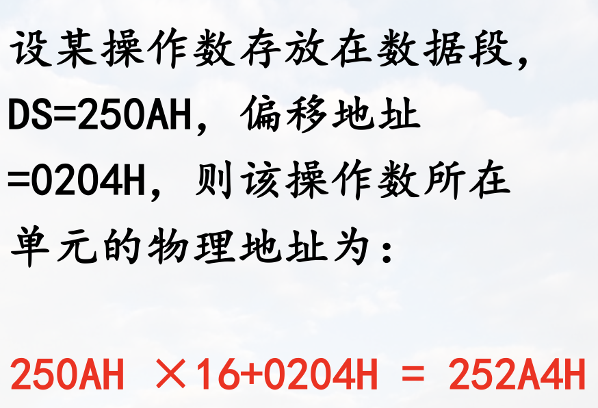

# 8086/8088微处理器

## 特点及工作模式

### 一. 特点

#### 1. CPU内部结构 采用并行流水线工作方式

将CPU划分成两个功能部件: 执行单元`EU`、总线接口单元`BIU`

并设置指令预取队列,实现流水线工作

> 分析指令时总线空闲, 可以取第二条指令, 于是两条指令的执行上时间有重叠  
> 如此CPU和总线一直在忙, 减少了执行多条指令的执行时间  

#### 2. 存储器寻址部分 对内存空间实行分段管理

主存空间`1M`, 将内存空间分为多个逻辑段

每个逻辑段不超过`64K`$(2^{16})$个单元

每个逻辑段通过段基(地)址区分(高16位)

段内每个单元的地址为相对于本段第一单元的距离，称为偏移地址(相对地址)

> 如`10000H` $\rightarrow$ `1000:0`  

#### 3. 工作模式 支持多处理器系统

通常有个主处理器, 如8086; 除此之外还有协处理器(执行特殊运算), 如8087、支持输入输出管理的处理器, 如8089

两种工作模式: 最小模式、最大模式

##### 最小模式

单处理器模式，控制信号较少，一般可不必接总线控制器

##### 最大模式

多处理器模式，控制信号较多，通过总线控制器与总线相连

## 引脚及功能

> 括号前的为最小模式下的名字, 括号内为最大模式下的名字  
> 8088 为准16位: CPU内寄存器为16位, 总线8位

### 一. 最小模式下8088的引线及功能

#### 1. 地址线和数据线

#### 2. 主要控制信号和状态信号

> `DT/R`控制数据收发器  
> `READY`用于同步扩展总线判断是否需要在总线周期内插入一个时钟周期, 高电平表示数据准备好, 不会插入时钟周期  
> 

#### 3. 中断请求和响应信号

> `INTA`是对`INTR`的响应, `NMI`总是响应

#### 4. 总线保持请求与响应信号

针对DMA请求

#### 8088与8086引线的差别

1. 数据总线宽度不同

    8088 外部总线宽度为8位  
    8086 外部总线宽度为16位

    > 内部都是16位

2. 访问主存和IO信号的差异不同

    8088: $IO/\overline{M} = 0$ 表示访存  
    8086: $\overline{IO}/M = 1$ 表示访存

### 二. 最大模式下8088的引线及功能

> * RQ/GT 一个引脚同时进行请求和响应(分时复用), 编号低的优先级高  
> * 总线封锁: 在一条指令执行时封锁总线控制权  
> 书后面有附表

## 8086/8088 功能结构  IM

### 一. 功能结构

> 寄存器都是16位  

> 对于清楚指令队列的情况: 现在有分支预测缓解这种情况

指令队列的存在使EU和BIU两个部分可并行工作，即实现指令的并行执行

* 提高了CPU的效率
* 降低了对存储器存取速度的要求

### 二. 内部寄存器

含14个16位寄存器

* 8 个**通用寄存器**
* 4 个段寄存器
* 2 个控制寄存器

**注意理解各寄存器的作用**  IM

#### 通用寄存器 8 个

通用寄存器可以存放数据, 各寄存器又有特殊作用

##### 数据寄存器

AX BX CX DX

每个数据寄存器可拆分为2个8位寄存器单独使用

* AX $\rightarrow$ AH, AL  
    其中AX AL又称为累加器: 存放中间结果; 所有IO指令都通过AX与接口传输信息
* BX $\rightarrow$ BH, BL  
    基址寄存器: 在间接寻址中用于存放基地址
* CX $\rightarrow$ CH, CL  
    计数器: 用于在循环或串操作指令中存放计数值
    > 多指令构成的循环语句可能不适用CX, 如 for loop
* DX $\rightarrow$ DH, DL  
    数据寄存器; 也可用于IO端口间接寻址(`IN、OUT`指令端口号较短时可直接写在指令内(8位), 否则写在DX中)、在32位乘除法运算时, 存放高16位数

##### 地址指针寄存器

SP BP

* SP  
    堆栈指针寄存器,其内容为栈顶的偏移地址(如果不用堆栈那就是普通的数据寄存器)
* BP  
    基地址指针寄存器, 常用于在访问内存时存放内存单元的偏移地址

> 作为基址寄存器  
> 用BX表示所寻找的数据在数据段(如高级语言中的全局变量)  
> 用BP则表示数据在堆栈段(如高级语言中自己定义的局部变量)(又如在不动SP的前提下访问堆栈里的内容)

##### 变址寄存器

变址寄存器在指令中常用于存放数据在内存中的偏移地址

* SI 源变址寄存器
* DI 目标变址寄存器

#### 控制寄存器 2 个

##### 指令指针寄存器IP

存放预取指令偏移地址

##### 标志寄存器FLAGS

黑色: 状态标志位

* CF (Carry Flag)  
    进位标志位。加(减)法运算时，若最高位有进(借)位则CF=1
* PF (Parity Flag)  
    奇偶标志位。运算结果低8位中“1”的个数为偶数时PF=1
* AF (Auxiliary Carry Flag)  
    辅助进位标志位。加(减)操作中，若Bit3向Bit4(半字节)有进位(借位)，AF=1
* ZF (Zero Flag)  
    零标志位。当运算结果为零时ZF=1
* SF (Sign Flag)  
    符号标志位。当运算结果的最高位为1时，SF=1
* OF (Overflow Flag)
    溢出标志位。当算术运算的结果超出表示范围时，OF=1

红色: 控制标识位

* TF (Trap Flag)  
    陷井标志位，也叫跟踪标志位。  
    TF=1时，单步执行方式
* IF (Interrupt Enable Flag)  
    中断允许标志位,IF=1则CPU响应中断请求
* DF (Direction Flag)  
    方向标志位，串操作的方向  
    DF=0，按增地址方式；DF=1，按减地址方式

> 例  
> 给出以下运算后各状态标志位的状态  
> `010110110`  
> `+11110100`
> 

#### 段寄存器

> 代码段: 存放指令  
> 数据段: 存放自己定义的数据  
> 堆栈段: 用于堆栈  
> 附加段: 也存放数据, 多用于串操作指令(将一个串搬到另一个地方, 有些指令要求两个串不在同一个段)  
> 不需要全部存在
>
> 段基址: 一个段的最低地址(第一个单元)的高16位, 人为约定

## 存储器组织  IM

### 一. 物理地址与逻辑地址

#### 物理地址

指每个内存单元在整个内存空间中的唯一地址

物理地址空间取决于地址线位数

8086/8088CPU地址线20根，每个存储单元物理地址20位，可寻址最大内存容量为1MB(8086/8088存储器按字节编址)

1MB存储单元的地址范围为  
00 ... 0(20位)  ~  11 ... 1(20位)

为了方便书写，在源程序中常用5位十六进制数来表示一个存储单元的地址

> 注意五个F之前要加个0(在机器上使用)

#### 字单元的地址与存放规则

两个相邻字节单元构成一个字单元

字单元的地址为两个字节单元中较小地址单元的地址

字数据的存放规则是低8位放在较低地址字节单元，高8位放在较高地址字节单元（小端模式）

#### 逻辑地址

存储器分段管理, 将存储空间分为若干逻辑段

每个存储单元的地址由16位段基址、16位偏移地址两部分组成，构成逻辑地址

`XXXXH:YYYYH`

逻辑段的起始单元称为段首, 其地址叫段首地址

偏移地址是相对于本段起始单元的距离

> 
>
> 

#### 地址转换

##### 逻辑地址 $\rightarrow$ 物理地址

物理地址=段基址×16+偏移地址

>   
> 

##### 物理地址 $\rightarrow$ 逻辑地址

##### 逻辑段的特点

逻辑段最大长度64K
> 因为有16位  
> 一般用不到那么大

每个段的起始地址必须是一个小节的首址(低4位为0)

逻辑段之间的关系：邻接、间隔、部分重叠的和完全重叠

任一时刻，一个程序最多只能访问4个逻辑段

分段的优点: 程序只需要管理段内偏移地址, 不需要管理段地址(有操作系统管理), 而实际执行的时候, 又有方法计算出物理地址

> 例  
> 

### 二. 段寄存器的使用

8088/8086对段寄存器使用的规定

> 注意串操作的目的串只能设置为ES

### 三. 堆栈及堆栈段段使用

#### 堆栈的概念

堆栈是按特定规则访问的存储区

主要用于暂存数据以及在过程调用或处理中断时保存断点信息

堆栈一般分为专用堆栈存储器和软件堆栈

软件堆栈: 由程序设计人员用软件在内存中划出的一块存储区，8086/8088采用这种方式

#### 堆栈指针 SP (Stack Point)

寄存器SP指示栈顶位置，在入栈、出栈操作中提供间接寻址

> 注意图里的SP是相对`00000H`的距离

#### 8088/8086 堆栈的组织

在8086/8088微机中堆栈是由堆栈段寄存器SS指示的一段存储区

> 注意SP一开始在栈底底下一个单元(按字)

#### 8086/8088 堆栈的使用

1. 数据在堆栈中以字为单位存放，低8位放在较低地址单元，高8位放在较高地址单元
2. 堆栈初始化时SP指向栈底+2单元，其值就是堆栈的长度,不大于64K字节
3. SP表示栈顶单元与堆栈段基址之间的距离(字节数)
    * 当SP为最大(初始)值时，表示堆栈为空
    * 当SP为0时，表示堆栈全满
4. 当用户程序中要求的堆栈长度超过64KB时，可以设置多个堆栈段

> 堆栈使用例  
> 
> 堆栈段长度为 202H 注意最后一个单元 $\neq$ SP初值

## 总线时序

### 一. 最小模式下的总线

> 8282: 地址锁存器(类似三态门)  
> ALE: 地址锁存有效, 为1是三态门才打开  
> 8286: 数据收发器  
> DEN: 控制数据收发器打开与否, 为0打开  

### 二. 最大模式下的总线

> 多了总线控制器

### 三. 总线时序

了解即可

#### 总线周期

* CPU完成一次访问内存/接口操作所需要的时间
* 一个总线周期至少包括4个时钟周期

#### 总线时序

CPU各引脚信号在时间上的关系

#### 8088 读周期

#### 8088 写周期

#### 延长的总线周期

编码炸了, 回头补上
