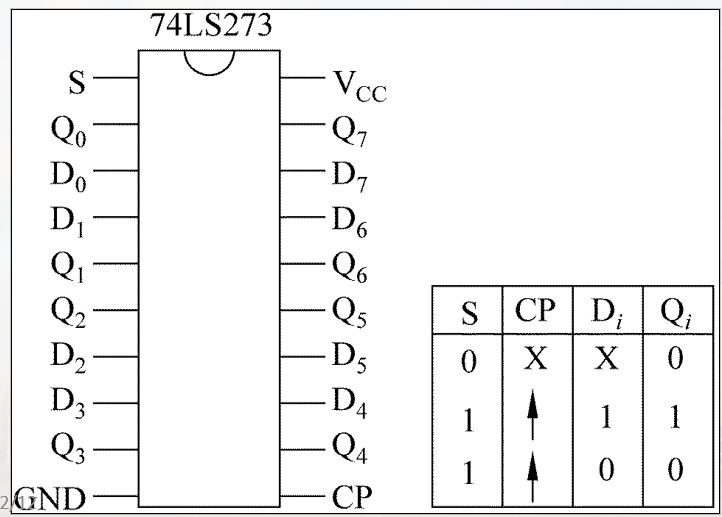
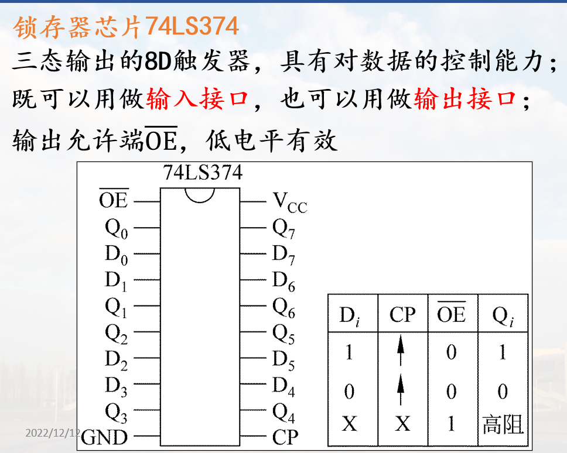

# 简单接口电路及应用

## 三态门接口

三态门具有数据控制能力, 常用作输入接口


### 74LS244

* 8个三态门
* 两个控制端: $\overline{E1}、\overline{E2}$
* 控制端有效时, 外设与总线联通


### 示例


## 锁存器接口

具备对数据的锁存能力, 常用作输出接口

CPU输出的数据经数据总线送锁存器锁存, 直到设备将数据取走

采用具有信息存储能力的双稳态触发器构成;


### 锁存器芯片74LS273

* 8D触发器, 有锁存能力, 常用作输出接口
* S:异步复位端, 低电平有效
* CP：同步脉冲输入, 上升沿触发



### 锁存器芯片74LS374

* 三态输出的8D触发器, 具有对数据的控制能力;
* 既可以用做输入接口, 也可以用做输出接口;
* 输出允许端$\overline{OE}$, 低电平有效



### 74LS374作输出接口示例


### 74LS374作输入接口示例


## IO接口应用示例

### 例1

外设状态端口地址为`03FBH`, 第5位(bit5)为状态标志（=1忙, =0准备好）

外设数据端口地址为`03F8H`, 写入数据会使状态标志置1; 外设把数据读走后又把它置0

试画出其电路图, 并将BUF中的100个字节数据输出。

#### 电路图


#### 控制程序


```asm
        LEA SI, BUF
        MOV CX, 100
AGAIN:  MOV DX, 03FBH   ; 状态端口
WAITT:  IN  AL,DX       ; 读状态端口         
        TEST AL,20H
        JNZ   WAITT    ; 设备   
        MOV DX,03F8H   ; 数据端口
        MOV AL, [SI]
        OUT DX, AL     ; 写数端口
        INC SI
        LOOP  AGAIN
        HLT
```

### 例2

* 根据开关状态在7段数码管上显示数字或符号
* 当4个开关的状态分别为`0000～1111`时，在7段数码管上对应显示’0’～’F’
* 设输出端口的地址为`0F0H`,输入端口地址为`0F1H`


> 发光二极管高电平亮  
> 输入端口: 连开关  
> 输出端口: 连数码管

#### 电路图


> 74LS273作为输出接口. 74LS244作为输入接口  
> DP为小数点指示, 不使用  
> 要发光二极管亮, 则对应的 Q 则应为1  
> 开关关, 低电平; 开关开, 高电平

#### 数码管显示


> 注意小数点不显示, Dp为0

#### 控制程序

```asm
        ……
Seg7  DB  3FH,06H, 5BH,4FH,66H,6DH, 7DH,07H, 
    7FH,67H,77H, 7CH,39H,5EH,79H,71H
        ……
        LEA    BX, Seg7
        MOV    AH, 0
GOON:   IN     AL, 0F1H   ;读输入端口
        AND    AL, 0FH    ;屏蔽高4位，保留低4位的开关状态 
        MOV    SI, AX      ;计算在Seg7中的位移量
        MOV    AL, [BX+SI]
        OUT    0F0H, AL  ;写输出端口
        JMP    GOON
```
