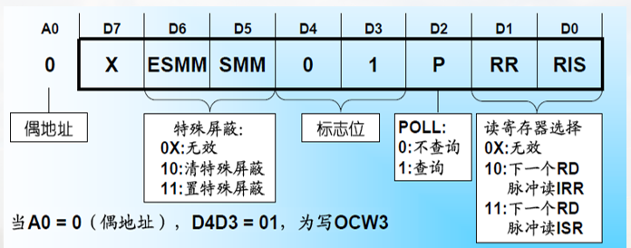

# 中断处理器 8259A

## 基本结构

### 1. 引脚图


### 2. 内部结构


* 数据总线缓冲器
  * 三态双向8位缓冲器，与数据总线低8位D7~D0相连

* 读写控制逻辑
  * 输入信号: $\overline{RD}$、$\overline{WR}$、$\overline{CS}$、$A0$
  > A0 用于区分控制字(连地址总线最低位)  
  > $\overline{CS}$ 为片选

* 级联缓冲/比较器
  * 扩展中断源，主片的CAS2~CAS0输出，从片的CAS2~CS0输入；从片的INT接主片的IRi

* 中断请求寄存器IRR
  * 某外设有中断请求，则相应位置1
  * 该中断被响应后，相应的请求位清0

* 中断屏蔽字寄存器IMR
  * 软件设定屏蔽字，为‘1’的位对应的中断被屏蔽

* 中断服务寄存器ISR
  * 保存所有正在服务的中断源，对应位为‘1’
  * 允许中断嵌套时,ISR中可以有多位被置‘1’

* 优先判别器PR
  * 综合IRR、IMR和ISR进行判优，并判定是否产生INT生成优先级最高的中断类型号

* 控制逻辑
  * 根据PR判定结果向CPU发INT信号
  * 接收到CPU第一个$\overline{INTA}$信号后，ISR对应位置‘1’，且IRR对应位清‘0’
  * 接收到CPU第二个$\overline{INTA}$信号后，送出优先级最高的中断类型号

## 工作过程

接收中断请求->判断是否发INT,生成优先级最高的中断号->CPU响应，接收应答信号$\overline{INTA}$，修改ISR和IRR，送中断号


> IRR 内, 为1表示有中断请求  
> 中断类型码高五位一般为`00001`(图中五个x)

## 工作方式

可通过编程设置不同的工作方式

* 工作方式
  * 中断优先方式与中断嵌套
  * 屏蔽中断源方式
  * 级联工作方式
  * 终端结束(EOI)处理方式
  * 中断触发方式

### 1. 中断优先方式与中断嵌套

#### 1) 中断优先方式

* 固定优先级方式(默认):
  * IR0>IR1>...>IR7, 可通过编程修改优先级顺序
* 循环优先级方式:
  * 自动循环，某中断源得到中断服务之后，其优先级降为最低，原来比它低一级的成为最高，依次排列

> 例，若初始优先级为IR0>IR1>……>IR7，则对IR4进行服务之后，优先级顺序为:   
> IR5>IR6>IR7>IR0>IR1>IR2>IR3>IR4

#### 2) 中断嵌套

* 普通全嵌套方式
  * 中断服务期间，只有比它优先级更高的中断请求才会被响应(没有同级)

* 特殊全嵌套方式
  * 中断服务期间，可以被同级或比它优先级更高的中断请求所打断
  > 一般用在级联方式，主片8259A可以使用特殊全嵌套方式

### 2. 屏蔽中断源方式

#### 1) 常规屏蔽方式

设置IMR，某位为“1”则屏蔽对应的中断请求

#### 2) 特殊屏蔽方式(SMM)

使正在处理的中断所对应的IMR位置1，并使对应的ISR位清零

可响应除当前级别优先级中断外的其他所有级别中断

### 3. 级联工作方式


> 理论上可以扩展到64个中断源(每个脚都进行扩展 8 * 8)  
> 主片: 直接和CPU连接的中断处理器  
> 从片: 级联连接的中断处理器

### 4. 中断结束(EOI)方式

指8259A结束中断事件的处理方式(ISR的清零)

* 自动中断结束方式
  > 在第二个INTA信号发送后就认为中断结束(及时中断服务程序未结束)

* 非自动中断结束方式
  > 在中断服务程序完成后才清理ISR
  * 正常中断结束方式
  * 特殊中断结束方式

### 5. 中断触发方式

IRR 内某一位为1的条件(为1就表明有中断处理请求)

* 电平触发方式
  * 把中断请求输入端的**高电平**作为中断请求信号
  > 可能导致多次触发

* 边沿触发方式
  * 将中断请求输入端IRi出现的**上升沿**作为中断请求信号

## 内部控制字及编程

可编程8259A: 可通过编程方式写入控制命令设置8259A的工作方式

控制命令分为**初始化命令字ICW1~ICW4**和**操作命令字OCW1~OCW3**，写入后保存在内部的ICW和OCW寄存器组

> 初始化命令字: 开始工作前  
> 操作命令字: 工作时

**初始化编程**: 工作之前，CPU向8259A按顺序写2~4字节初始化命令字ICW

**操作方式编程**: CPU向8259A送3字节操作命令字OCW，设置操作方式

### 1. 8259A的内部寄存器访问方法


> IRR/ISR的区分: OCW3内容确定  
> ICW2,3,4的区分: 根据顺序, 也就是说ICW设置有顺序要求

### 2. 8259A初始化命令字

在8259A工作之前进行初始化, **按顺序写ICW**

* ICW1（初始化字）
* ICW2（中断类型码字）
* ICW3（级联控制字）
* ICW4（中断结束方式字）

#### 3. 8259A初始化流程


#### 初始化字

##### 1) ICW1

* 写入条件: A0=0（偶地址）；D4=1
* 作用: 初始化8259A；同时清除ISR、IMR；设置优先级初始(默认)状态、常规屏蔽方式、非自动EOI方式


##### 2) ICW2

* 条件: A0=1（奇地址）
* 作用: 初始化时写入中断类型码高5位


前5位默认位`00001`

##### 3) ICW3

* 条件: A0=1（奇地址）
* 作用: 设置主从片标志，仅在多片8259A级联时需要初始化


##### 4） ICW4

* 条件: A0=1（奇地址）
* 作用: 设置中断结束方式，仅在需要时设置 (ICW1的D0=1)


#### 示例

以8086/8088微型计算机中使用的单片8259A为例，试对其进行初始化设置，其中ICW1和ICW4的端口地址分别为20H、21H。

实现初始化的程序段如下: 

```asm
MOV AL, 13H ; 设置ICW1（边沿触发，单片，要写ICW4）
OUT 20H, AL ; 写ICW1
MOV AL , 18H ; 设置ICW2（中断类型码高五位设置为00011）
OUT 21H, AL ; 写ICW2
MOV AL, 0DH ; 设置ICW4（一般全嵌套，非AE01，缓冲方式）
OUT 21H, AL
```

### 3. 8259A操作命令字

在8259A工作期间，可通过操作命令字(OCW)设置操作方式

操作命令字: OCW1~OCW3，没有写入顺序和时间要求，可独立使用

OCW1写入奇地址，OCW2和OCW3写入偶地址

* OCW1（中断屏蔽字）
* OCW2（中断结束和优先级循环）
* OCW3（屏蔽方式和状态读出方式）

#### 命令字

##### 1) OCW1

* 条件: A0=1（奇地址）

* 作用: 写中断屏蔽字，保存在IMR


###### 示例

若要屏蔽IR5、IR4和IR1引脚上的中断，而允许其余的中断，设置中断屏蔽字

OCW1为: 00110010 （32H）

##### 2) OCW2

* 条件: A0=0（偶地址），特征位 D4D3=00

* 作用: 对8259A发中断结束命令EOI，以及控制优先级循环


###### 示例

若某8259A的OCW2设置为11000011B，试分析此操作命令字所确定的操作方式

分析: 特殊循环优先级，将IR3定为最低优先级。因此，系统中优先级从高到低为IR4、IR5、IR6、IR7、IR0、IR1、IR2、IR3

##### 3) OCW3

* 条件: A0=0（偶地址），特征位 D4D3=01

* 作用: 设置中断屏蔽方式和中断状态查询方式




### 4. 8259A编程示例

设两片8259A级联，提供15级向量中断，CAS2～CAS0作为互连线，从片8259A的INT直接连到主片8259A的IR2上

* 主片端口地址020H和021H，中断号为08H～0FH；从片端口地址0A0H和0A1H，中断号为70H～77H；
* 主、从片的中断请求信号均采用边沿触发方式；
* 优先级的排列次序为0级最高（主片IR0），依次为1级（主片IR1）、2级（主片IR2，对应从片IR0 ～IR7）、3级～7级（主片的IR3～IR7）


```asm
;对主片8259A的初始化 
    INTM00    EQU   020H           ;主8259A端口，偶地址
    INTM01    EQU   021H           ;主8259A端口，奇地址
    ……      
       MOV  AL, 11H    ;写ICW1，设定边沿触发，级联方式
       OUT  INTM00, AL
       JMP  INTR1      ;延迟,等到8259操作结束，下同
INTR1: MOV AL, 08H     ;写ICW2，设主片中断类型码高5位，IRQ0为08H
       OUT INTM01, AL
       JMP  INTR2
INTR2: MOV  AL, 04H   ;写ICW3，设主片IRQ2级联从片的INT 
       OUT  INTM01, AL
        JMP  INTR3
INTR3:  MOV  AL, 11H   ;写ICW4，设置特殊全嵌套方式，一般EOI方式
          OUT INTM01, AL
         ……

```

> 转移指令只转移到下一条，为什么？（三个JMP）
> 为了起到一个延时的作用
