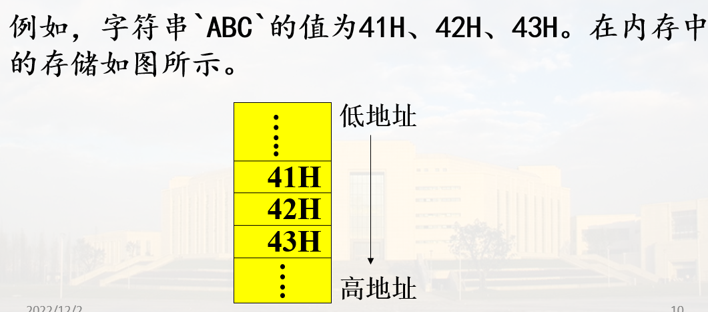

# 汇编语言基础

## 一. 汇编语句类型

### 1. 语句类型

#### 1) 指令性语句

在汇编时产生一个可供CPU执行的及其<font color=red>目标代码</font>, 又叫可执行语句

格式:


* <font color="red">指令助记符必须有</font>，操作数个数可以为0，1，2
* <font color="red">标号字段可选</font>，后面必须跟“：”。
* <font color="red">注释字段可选</font>，以分号“;”开始。
  * 注释不产生机器目标代码，不影响程序功能。
  * 注释可以在指令后面，也可以单独一行。

示例:

```asm
         MOV AX, BX      ；双操作数指令
         INC AX          ；单操作数指令
         PUSHF           ；隐含操作数
         MOV  CL, 4
         ROL  AH, CL
 LABEL1：ADD  AX，BX    ；功能为AX<=(AX)+(BX)
         ;后面的程序段完成一次对存储器的访问
```

#### 2) 指示性语句

指示性语句又叫<font color="red">伪指令语句、伪操作</font>语句。

<font color="red">不产生目标代码</font>，用于指示汇编程序如何进行<font color="red">汇编</font>。

格式:


```asm
DATA1 DB 20H   ; 伪指令符DB定义一个字节单元
END            ; 伪指令END停止汇编      
```

### 2. 标识符

指令语句中的<font color="red">标号</font>和伪指令语句中<font color="red">符号名</font>统称为**标识符**

#### 构成规则

1. 由 1-31 个字符组成
2. <font color=red>第一个字符</font>必须是字母、问号、@、下划线<font color=red>四种字符之一</font>
3. 从第二个字符开始，可以是字母、数字、@ 、 下划线_或问号“？”
4. 不能使用系统专用的保留字

#### 专用保留字

* 寄存器名
* 指令助记符(如ADD)
* 伪指令符 如(DB)
* 表达式中的运算符(如GE、EQ)以及属性操作符(如PTR、OFFSET等)

## 二. 数据项

### 1. 常量

经过汇编后其值已完全确定，并且在程序运行过程中，其<font color="red">值不会发生变化</font>

常量的类型: <font color="red">数值常量与字符常量</font>

#### 1) 数值常量

* 二进制数：以字母B结尾，如01001001B
* 八进制数：以字母O或Q结尾，如631Q、254O
* 十进制数：以字母D结尾，或者没有结尾字母, 如2007D、2007
* 十六进制数：以字母H结尾，如3FEH、<font color="red">0</font>F1H

> 注意最后的十六进制数的零

#### 2) 字符串常量

用单引号括起来的一个或多个字符，其值为这些字符的<font color="red">ASCII码</font>值



#### 常量的应用

1. 作指令语句的源操作数

    ```asm
    MOV AX, 0B2F0H
    ADD AH, 64H
    ```

2. 存储器操作数中作<font color=red>偏移地址</font>或<font color=red>位移量</font>

    ```asm
    MOV  BX，[1200H]
    MOV  0ABH[BX]，CX
    ADC  DX，100H[BP][DI]
    ```

3. 在数据定义伪指令中作变量初值

    ```asm
    DATA1 DB 10H 
    DATA2 DW 3210H
    ```

### 2. 变量

用来表示存放数据的<font color="red">存储单元</font>，程序运行期间<font color="red">变量值可以被改变</font>

程序中以<font color=red>变量名</font>的形式来访问, 也称为<font color=red>符号地址</font>

例:

```asm
MOV  AH，DATA1   ；DATA1为字节
MOV  AX，DATA2   ；DATA2为字
```

#### 变量的属性

* 段属性: 变量所在段的<font color=red>段基址</font>
* 偏移量属性: 表示变量所在单元与起始段单元之间的<font color=red>字节数</font>

> 段属性和偏移量属性构成变量的逻辑地址

* 类型属性: 表示数据区中存取操作对象的字节数, 有`BYTE WORD DWORD QWORD TBYTE`

### 3. 标号

标号加在指令的前面，是指令在内存的起始地址的符号表示，即<font color="red">指令地址的别名</font>

标号主要用作<font color="red">转移的目的地</font>

```asm
    MOV   CX, 100
LAB:MOV  AX, BX
    LOOP  LAB        ; LAB为目标地址
    JNE    NEXT       ; NEXT为目标地址
    ……
NEXT: ……
```

#### 标号的属性

* 段属性：表示该标号所代表的地址在哪个逻辑段中，即**段基址**
* 偏移量属性：表示该标号所代表的地址在段内与段起始单元间的字节数，即地址的**偏移量**
* 距离属性（也叫类型属性）：表示该标号可以被**段内**还是**段间**的指令使用

> NEAR(近)：只能用作**段内转移/调用**的目标地址  
> FAR(远)：可以用作**段间转移/调用**的目标地址

## 三. 表达式与运算符

表达式是指令或伪指令语句操作数的常见形式,由常数、变量、标号等通过运算符连接而成

例：

`MOV AX，3*5+2`

<font color="red">表达式的值在程序被汇编的过程中进行计算确定</font>

### 1. 算术运算符

+、-、＊、 / 、MOD

#### 1) 数值运算

"+"、“-”、“＊”、“/”(整除)、“MOD”(取余)运算符，作用于数值表达式，结果为数值

```asm
NUM = 15＊8；NUM=120
NUM = NUM/7；NUM=17
NUM = NUM MOD 3；NUM=2
NUM = NUM+5；NUM=7
NUM = -NUM-3；NUM=-10
NUM = -NUM-NUM；NUM=20
```

#### 2) 地址运算

“+”、“-” 运算符可作用于地址表达式，表示地址运算。

例:

将字数组NUM的第8个字内容送累加器AX

`MOV  AX， NUM+(8-1)*2`

### 2. 逻辑运算符

`NOT AND OR XOR` 注意<font color=red>只用于数值表达式, 不是指令</font>


### 3. 关系运算符

EQ（等于）、NE（不等于）、LT（小于）、LE（小于等于）、GT（大于）、GE（大于等于）

比较两个表达式的大小。两个表达式必须`同为常数`或`同一逻辑段中的变量`

* 常量比较，则按无符号数进行比较
* 变量比较，则<font color="red">比较偏移量的大小</font>

关系运算的结果为“真”(全1)或“假”(全0)

#### 关系运算符示例


### 4. 取值运算符

#### 1) `SEG` 运算符

取变量或标号所在段的<font color="red">段基址</font>

#### 2) `OFFSET` 运算符

取变量或标号在段内的<font color="red">偏移地址</font>

> `LEA`指令也行


#### 3) `TYPE` 运算符

取变量或者标号的类型属性, 用数值表示


### 5. 属性修改运算符 `PTR`

PTR用于临时指定标号、变量的“类型”属性。

格式: `类型 PTR 地址表达式`


### 6. 其他运算符

* 下标运算符 `[ ]`

  格式: 表达式1[表达式2]

  例：`MOV   AX，DA_WORD[20H]`

* 段重设运算符“：”

  例: `MOV   AX，ES: [DI]`

## 小结

1. 语句类型及格式：
  <font color="red">指令性语句</font>，汇编后生成目标代码
  <font color="red">指示性(伪指令)语句</font>，不生成目标代码
2. 数据项与表达式：
  <font color="red">常量</font>：数值常量、字符串常量,无属性，不占存储空间
  <font color="red">变量</font>：作用、属性（段\偏移量\类型属性）
  <font color="red">标号</font>：定义形式，属性（段\偏移量\类型属性）
  <font color="red">表达式</font>：运算符连接数据项，汇编时确定值
  <font color="red">常用运算符</font>：算术运算符、关系运算符、逻辑运算符、取值运算符、属性修改运算符
