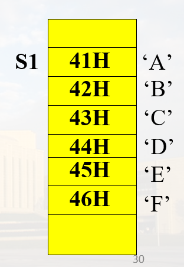
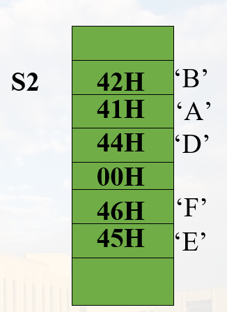
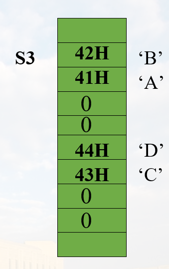
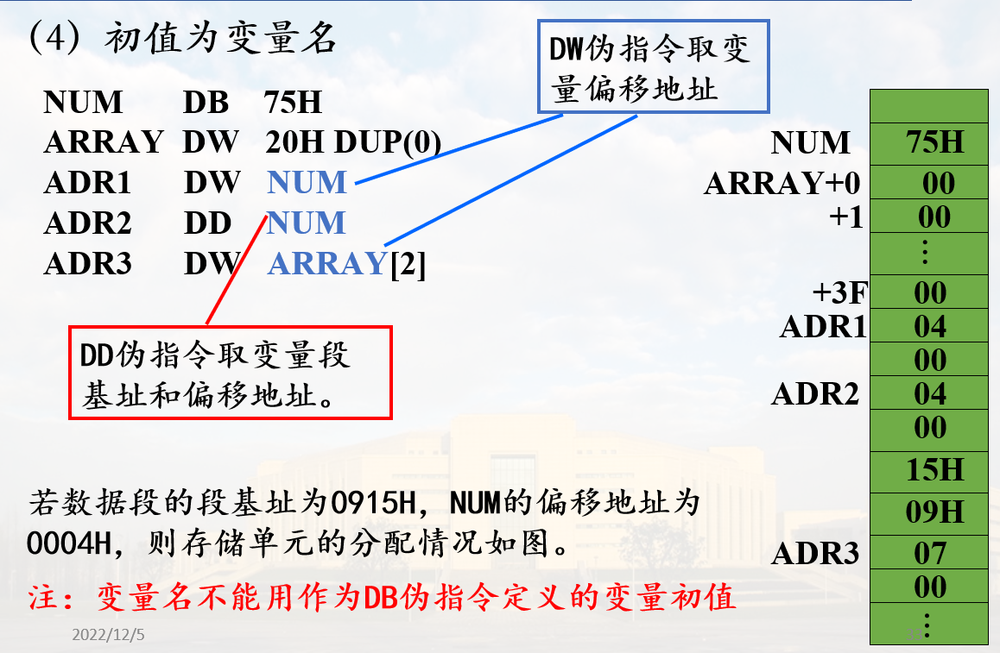
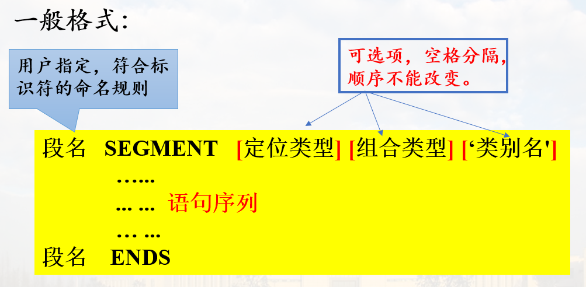
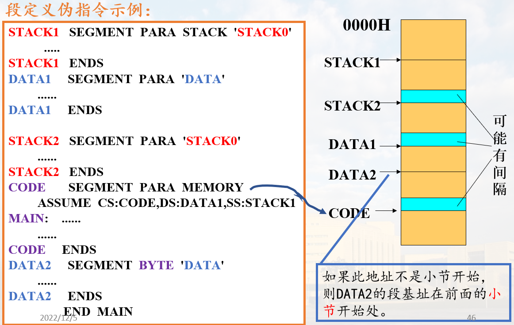
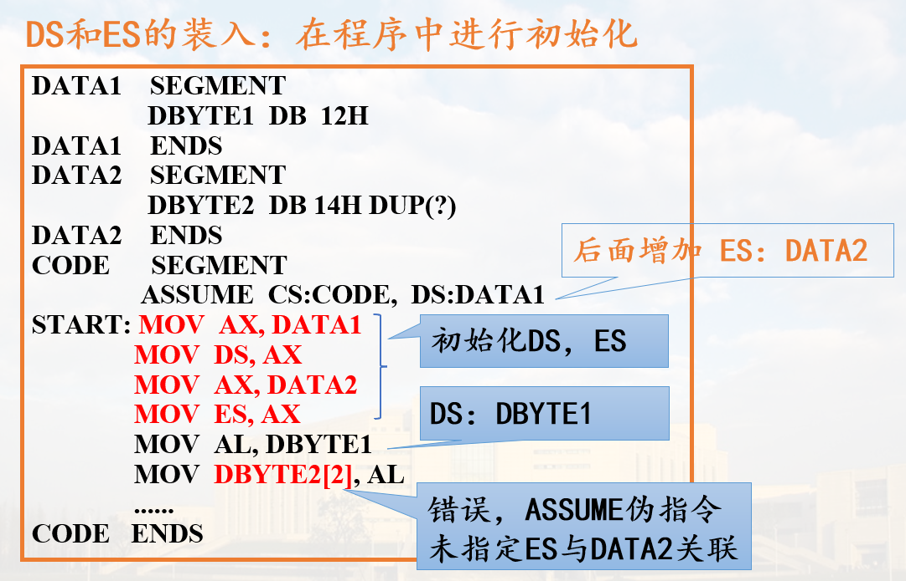
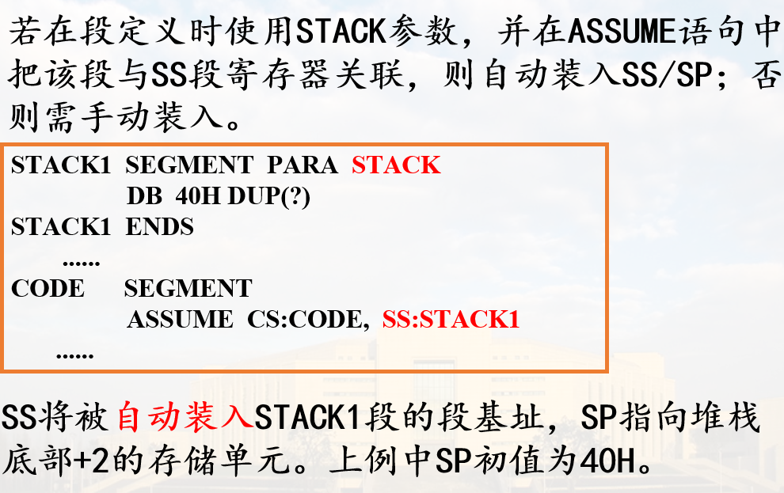
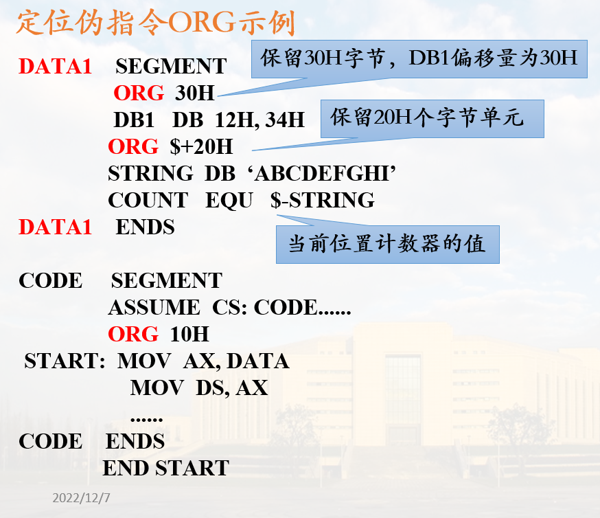

# 常用伪指令

## 一. 数据定义伪指令

数据定义伪指令用于<font color=red>定义变量</font>, 指定变量类型, 给变量赋初值, 分配存储空间

### 1. 格式

`[变量名] 伪操作 初值表`

伪操作有5种:

* DB: 字节变量，每个数据占一字节
* DW: 字变量，每个数据占两字节，低字节在低地址单元
* DD: 双字变量，每个数据四字节，低字节在低地址单元
* DQ: 四字变量，每个数据八字节，低字节在低地址单元
* DT: 十字节变量，每个操作数是十字节压缩BCD码

例:

```asm
DATA1    DB   12H，34H
DATA2    DW  12+23
DATA3    DD  12345678H
DATA4    DQ    0011223344556677H
DATA5    DT    0123456789H
;10字节压缩BCD码，按地址从低到高分别为：
;89H，67H，45H，23H，01H，00H，00H，
;00H，00H，00H
```

### 2. 变量初值

#### (1) 初值为数值

例如: `DATA1 DB 32, 30H`

#### (2) 初值不定

例如: `DA_BYTE DB ?, ?, ?`

可用于存储用户输入, 初值随机

#### (3) 初值为字符串

* 对于DB伪指令:
  * 字符串长度为 1-255个字符
  * 每个字符分配一个字节单元， 从左到右将各字符的ASCII码以地址递增的顺序依次存放



如 `S1 SB 'ABCDE'`

* 对于DW伪指令
  * 每个字符串由1-2个字符组成
  * 分配两字节存储单元
  * 前一个字符放在高地址, 后一个字符在低地址



例: `S2 DW ‘AB’,‘D’,‘EF’`

* 对于DD伪指令
  * 每个字符串由1-2个字符组成
  * 分配4个字节单元
  * 低地址字单元存放1-2个字符, 顺序与DW相同, 高地址字单元为0

例: `S3 DD 'AB', 'CD'`



**DW和DD伪指令定义的变量初值串不能超过两个字符**, `S1 DD 'ABCD'`为错误数据定义

#### (4) 初值为变量名

注意初值为变量名的情况下, 初值实际上为变量的偏移地址(和段地址)



> 第二行, 表示分配20个字单元, 初值为0  
> 如果有段基址(即DW), 则在高地址字节

<font color=red>此种初值不支持DB</font>

#### (5) 重复操作符 `DUP`

一般格式: `[变量名] 数据定义伪操作 表达式1 DUP (表达式2)`

表达式1: 重复的次数

表达式2: 重复的内容

例如:

```asm
DATA_A DB 10H DUP(?)
DATA_B DB 20H DUP('AB') ; 分配20H * 2 = 40H 个字节, 重复字符串'AB', 其中'A'在低地址
```

DUP 还可以嵌套使用, 即表达式2 又可以是一个带DUP的表达式

如: `DATA_C DB 10H DUP(4 DUP(2), 7)`

> 上面的表达式中, 4 DUP(2)分配4个单元, 每个内容都是2, 7表示再分配一个单元, 内容为7, 此时共5个单元, 故DATA_C有5 * 10H = 50H个字节

### 3. 变量的使用

#### (1) 在指令语句中单独用作操作数

例如:

```asm
DA1   DB   0FEH
DA2   DW   52ACH
……
MOV   AL, DA1      ;  **取值**，将0FEH传送到AL
LEA   SI,  DA2     ; 取DA2的**偏移地址**送到SI
```

#### (2) 变址/基址类寻址操作数, 变量名用作位移量

这里的位移量相对于段首

例如:

```asm
DA3 DB 10H DUP(?)
DA4 DW 10H DUP(1)
MOV DA3[SI], AL
ADD DX, DA4[BX][DI]
```

## 二. 符号定义伪指令

### 1. 等值语句

格式: `符号名 EQU 表达式`

#### 常数或数值表达式

```asm
COUNT EQU 5
NUM   EQU COUNT+5
```

#### 地址表达式

```asm
ADDR1 EQU DS:[BP+14]
```

#### 变量、寄存器名或指令助记符

```asm
CREG EQU CX
CBD  EQU DAA    ; DAA: BCD加法调节指令
```

<font color="red">**在同一个源程序中, 同一符号不能用EQU定义多次**</font>

### 2. 等号语句

格式: `符号名 = 表达式`

例如:

```asm
COUNT = 5
NUM = 14H
NUM = NUM + 10H
```

<font color="red">**同一符号可以用等号语句多次定义**</font>

<font color="red">等号语句不能为指令助记符定义别名</font>

符号定义伪指令不会为符号分配存储单元，定义的符号**没有地址属性和类型属性**

例如:

```asm
COUNT  EQU  5
……
MOV  BX,  OFFSET   COUNT    ; WRONG
MOV  AX, SEG     COUNT      ; WRONG
```

## 三. 段定义伪指令 IMPORTANT

伪指令SEGMENT/ENDS用于定义一个逻辑段,成对使用，分别表示段定义的开始与结束。

一般格式:



### 定位类型

定位类型用于告知汇编程序如何决定段的**地址边界**，即第一个可存放数据的单元位置

* PARA: 表示该段从一个小节的边界开始存放数据, OH结尾地址,定义逻辑段时**缺省的定位类型为PARA**

> 一个小节对应16个单元(0H结尾的地址)  
> PARA定位类型会有空间浪费问题

* BYTE: 表示该段起始数据单元地址可以是任一地址值
* WORD: 表示该段从一个偶数地址单元开始存放数据(最多浪费一个字节)
* PAGE: 表示该段从一个页面(256个单元, 00H结尾)的边界开始存放数据,以00H结尾的地址

### 组合类型

组合类型主要用在有多个模块(多个.asm文件)的程序中，用来**指定段与段之间的连接关系**

* NONE(默认): 表示本段与其他段无连接关系
* PUBLIC: 在满足定位类型的前提下，将与该段同名的段邻接在一起，形成一个新的逻辑段，共用一个段基址
* STACK: 把所有同名STACK类型的段连接成一个连续段，且系统**自动对SS和SP进行初始化**

> <font color="red">用户程序中一般至少有一个段用STACK说明，否则需要手动初始化SS和SP</font>

* COMMON: 产生一个覆盖段。在多个模块连接时，把用COMMON说明的同名段置成相同的段基址，共享存储区

> COMMON 的空间不是首位相接的, 而是共用一段内存

* AT 表达式: 直接指定段基址, 表示本段可定位在表达式所指示的小节边界上
* MEMORY: 表示本段在存储器中应定位在所有其它段之后的最高地址上

### 类别名

用单引号括起来的字符串，比如‘DATA’,为某一个段或几个相同类型段设定**类型名称**

连接程序时，把类别名相同的段存放在相邻的存储区

表示类别名的字符串可任意选定，但不能使用程序中的标号、变量名或其它定义的符号

### 例子



> 注意段基址

## 四. 设定段寄存器伪指令 `ASSUME`

格式:

`ASSUME 段寄存器名:段名[，段寄存器名:段名，...]`

说明:

* ASSUME的作用是告诉汇编程序,源程序中定义的逻辑段与哪个段寄存器关联
* ASSUME并**不设置**各个段寄存器的值，**DS、ES段寄存器的值由程序装入，CS值系统自动装入，SS可以自动设定(使用STACK组合类型)或手动装入**

### 示例


### DS 和 ES的装入



> 注意程序里不能直接把立即数赋给段寄存器, 需要AX中转

### SS的装入



### CS的装入

1. 按照END伪指令指定的地址<font color="red">**装入初始CS和IP**</font>

    格式: `END [起始地址]`

2. 在程序运行期间，<font color="red">**段间转移类指令**</font>，CPU自动修改CS和IP，指向新的代码段

## 五. 过程定义伪指令

格式:

```asm
过程名 PROC [NEAR|FAR]
      ......
      RET
      ......
过程名 ENDP
```

过程名是子程序的名称，用作过程调用指令`CALL`的目的操作数；具有段(所处逻辑段)、偏移量(距逻辑段的偏移)和距离(只能在同一个段内被调用, 可用PTR修改)三个属性

每一个过程中必须包含有返回指令`RET`,其作用是从该过程返回到主程序

## 六. 定位伪指令 `ORG`

数据定义伪指令如下:

```asm
VAR1 DB 10H, 20H
VAR2 DW 30H, 40H
```

汇编时如何安排变量在存储器中的位置?

使用<font color=red>位置计数器</font>(地址计数器)指示逻辑段中数据或指令的地址

源程序中使用符号`$`来表示<font color=red>位置计数器的当前值</font>

`ORG`指令用于**修改**数据计数器`$`的值

格式: `ORG 数值表达式`

作用: 将数值表达式的值赋给位置计数器`$`

说明: 表达式的值必须为正值，表达式中也可以包含`$`

### 示例



> 其中EQU即为串长度(字节)

## 小节

伪指令语句不生成目标代码；

各伪指令的功能、格式；

**数据定义伪指令**：初值表，存储规则，变量属性；

**符号定义伪指令**：不分配存储空间，无属性；

**段定义伪指令**：SEGMENT/ENDS；

**ASSUME伪指令**：关联段寄存器与逻辑段；

**段寄存器装入**：DS,ES,SS,CS装入方法

**过程定义伪指令**：PROC/ENDP,过程名属性

**ORG伪指令**：修改位置计数器$的值；
