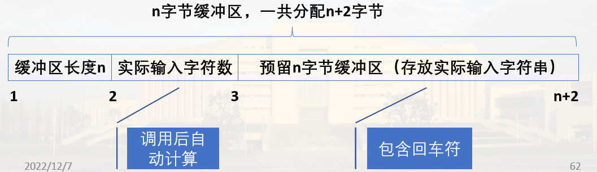

# DOS功能调用

## DOS功能调用方法

DOS操作系统为程序设计人员提供了可以直接调用的功能子程序

DOS功能调用可实现对系统资源的管理，比如键盘输入，数据显示，磁盘操作、文件管理等功能

DOS功能调用使用软中断指令`INT 21H`实现；
通过设置功能号(送AH)区分不同的子功能

### 步骤

1. 送<font color=red>入口参量</font>到指定的寄存器
2. 送<font color=red>功能号 -> AH</font>
3. 执行软中断调用`INT 21H`

> <font color=red>**完成调用后, 通常需要分析出口参数**</font>

## 常用DOS功能调用

### 1. 单字符输入(01H)

调用形式:

```asm
MOV AH, 01H
INT 21H
```

> 无入口参量

功能:
等待键盘输入，直到按下一个键。
将字符的ASCII码送入AL寄存器，并在屏幕上显示该字符

#### 示例

```asm
WAIT: MOV  AH，01H
      INT  21H
      CMP  AL,'Y' ;判断输入是否字符‘Y’
      JE   STOP       ;是'Y'
      JMP  WAIT       ;不是’Y’,继续等待
STOP: 
     …… 
```

### 2. 字符串输入(0AH号)

从键盘输入一个字符串(以回车结束)，最大长度255个字符

调用该功能前，在内存中<font color="red">**建立一个输入缓冲区, 缓冲区首地址送DX**</font>

n字节长度， 一共分配n+2字节



> 注意缓冲区内有回车

#### 示例

<font color="red">**入口参量**</font>：DS和DX分别装入输入缓冲区的段基址和偏移量

```asm
CHAR_BUF DB 31H            ;缓冲区的最大长度
         DB 0              ;存实际输入字符数
         DB 31H DUP(0)     ;输入缓冲区, 应该与上面的31H相等
         ......
MOV DX, SEG CHAR_BUF
MOV DS, DX                 ;注意不能直接传送
MOV DX, OFFSET CHAR_BUF    ;缓冲区偏移地址
MOV AH, 0AH
INT 21H
```

### 3. 单字符显示(02H)

说明:

2号功能调用实现在屏幕上显示单个字符.

入口参数：DL <= 待显示字符的ASCII码

示例:

```asm
MOV   DL，‘A’
MOV   AH，2
INT   21H
```

### 4. 字符串显示(09H)

实验字符串的<font color=red>屏幕显示</font>

入口参数:

1. 将带显示的字符串存放在一个数据缓冲区, 字符串以符号'$'作为结束标志
2. 将字符串首地址的段基址和偏移量送入DS和DX

示例:

```asm
CHAR DB 'This is a test.',0DH,0AH,'$'
..........
MOV  DX,OFFSET CHAR
MOV  AH,9
INT  21H
```

### 5. 返回DOS系统(4CH)

在程序结束时，使用两条指令实现返回DOS系统：

```asm
CODE  SEGMENT
      ASSUME  CS:CODE......
BEGIN:…
      …
      MOV AH, 4CH
      INT 21H
CODE  ENDS
      END BEGIN
```

## 小结

* DOS功能调用方法：
  * 入口参数送指定寄存器
  * 功能号->AH
  * 调用软中断指令INT 21H
  * [结果(出口参数)分析]
* 常用DOS功能调用：
  * 字符(串)输入/输出
  * 返回DOS系统(功能号4CH)
* DOS功能调用表（附D.3）
