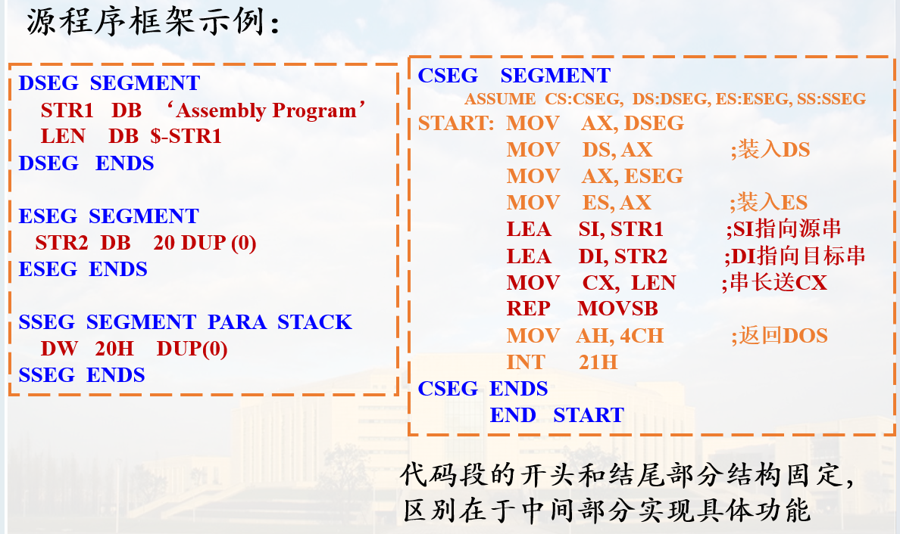
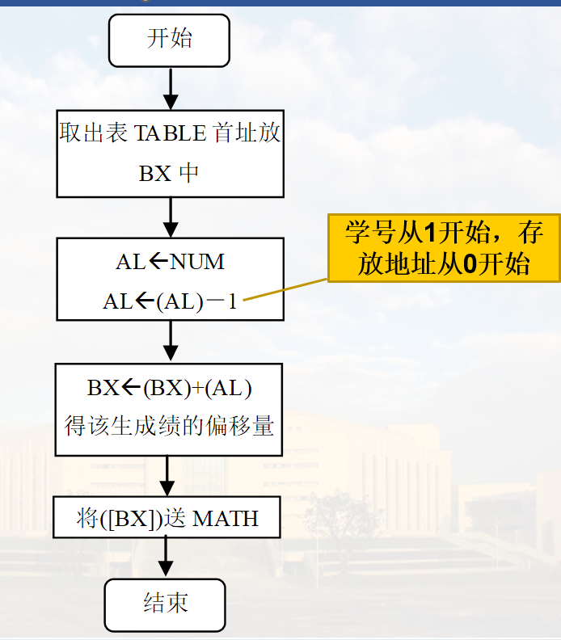
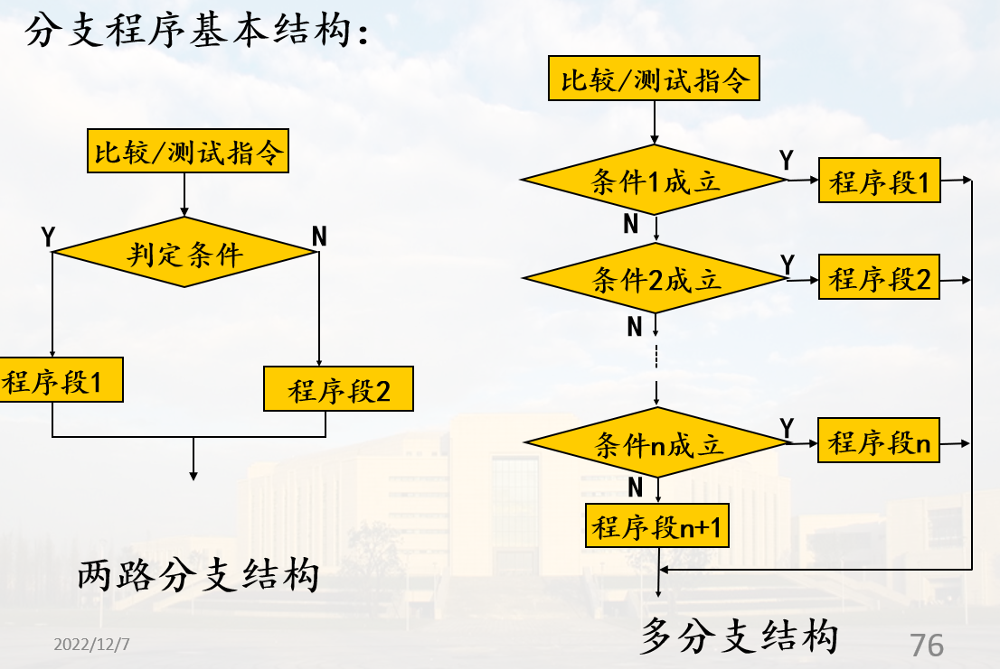

# 汇编语言程序设计

## 一般步骤

1. 问题分析, 确定数据结构与算法, 用流程图表示
2. 为数据分配存储空间
3. 编写汇编语言源程序, 保存为源程序文件（.ASM）
4. 汇编, 检查语法错误, 生成目标文件（.OBJ）
5. 链接, 生成可执行文件（.EXE）
6. 程序调试, 验证程序功能

## 基本框架

源程序由一个或多个逻辑段构成, 通常有数据段、堆栈段、附加段和代码段

**数据段**中主要通过数据定义伪指令定义变量

如果有**串操作**, 则需要定义**附加段**

堆栈段中通常用数据定义伪指令**分配堆栈空间**

**代码段**中包含指令语句



## 顺序程序设计示例

### 利用学号查学生的数学成绩表

#### 分析

首先在数据段中建立一个成绩表TABLE, 按照学号从小到大的顺序存放数学成绩。要查的学号存放在变量NUM中, 查表的结果放在变量MATH中

#### 流程图



#### 代码

```asm
DATA   SEGMENT
TABLE  DB     81, 78, 90, 64, 85, 76, 93, 82, 57, 80
       DB     73, 62, 87, 77, 74, 86, 95, 91, 82, 71
NUM    DB     8
MATH   DB     ?
DATA   ENDS

STACK1  SEGMENT  PARA  STACK
    DW   20H    DUP(0)
STACK1  ENDS
COSEG    SEGMENT
    ASSUME  CS:COSEG,  DS:DATA,  SS:STACK1
START:  MOV    AX, DATA         ;获取数据段基址
        MOV    DS, AX           ;装入DS
        MOV    BX, OFFSET  TABLE;BX指向表首址
        XOR    AH,AH            ;(AH)=0
        MOV    AL,  NUM         ;学号送AL
        DEC    AL               ;实际学号是从1开始的
        ADD    BX, AX           ;(BX)+(AX) 指向要查的成绩
        MOV    AL, [BX]         ;查到成绩送AL
        MOV    MATH,  AL        ;存结果
        MOV    AH,4CH           ;返回DOS
        INT    21H
COSEG  ENDS
    END   START
```

## 分支程序设计示例



用比较\测试指令+条件转移指令实现分支

* 比较指令：CMP DEST, SRC

    CMP指令与SUB功能相似, 区别是CMP指令不保存结果, 只是影响标志位, 后续转移指令通常用CF、ZF做判定。

* 测试指令：TEST DEST, SRC

    TEST指令与AND功能相似, 区别是逻辑“与”的结果不送入DEST, 只是影响标志位, 后续转移指令通常用ZF做判定。

### 示例1

数据段的ARY数组中存放有10个无符号数, 试找出其中最大者送入MAX单元

#### 分析

* 用AL存放当前最大数, 初值为ARY第一个数
* 从第二个数开始, 依次与AL当前值比较, 将较大的送入AL中
* 共比较9次
* 比较结束后, AL中存放的就是最大数

#### 流程图


#### 代码

```asm
DATA  SEGMENT
    ARY    DB    17, 5, 40, 0, 67, 12, 34, 78, 32, 10
    MAX    DB    ?
DATA   END

STACK1  SEGMENT  PARA  STACK
        DW   20H    DUP(0)
STACK1  ENDS
CODE    SEGMENT
    ASSUME  CS:CODE, DS:DATA, SS:STACK1
BEGIN:  
        MOV   AX, DATA
        MOV   DS,  AX
        MOV   SI, OFFSET ARY ; SI指向ARY的第一个元素
        MOV   CX, 9          ;CX作次数计数器
        MOV   AL, [SI]       ;取第一个元素到AL
LOP:    INC   SI             ;SI指向后一个元素      
        CMP   AL, [SI]       ;比较两个数
        JAE   BIGER          ;AL≥[SI],AL不需修改
        MOV   AL, [SI]       ;修改AL
BIGER:  DEC   CX             ;减1计数
        JNZ   LOP            ;CX≠0, 继续比较下一个数
        MOV   MAX, AL        ;CX=0, 比较结束, 存最大数
        MOV   AH,  4CH 
        INT   21H
CODE  ENDS
    END   BEGIN
```

### 示例2

当前数据段SCORE开始连续存放30位同学的某门课程成绩, 编程统计90-100分、80-89分、70-79分、60-69分以及<60分的人数, 并将结果存入同一段的RES开始的5个单元

#### 分析

* 多路分支结构, 每位同学成绩依次与90, 80, 70, 60进行比较
* 成绩当作无符号数, 用CF作判定条件
* 重复30次
* 字节单元存放成绩和结果

#### 代码

```asm
DATA  SEGMENT
    SCORE  DB   85,49,92,63,77,100,58,80,63,79, 36,62,93,84,91
           DB   91,48,70,75,89,80,62,75,94,66,60,56,80,84,69
    RES    DB   5 DUP(0)
DATA   END

STACK1  SEGMENT  PARA  STACK
        DW   20H    DUP(0)
STACK1  ENDS

CODE    SEGMENT
              ASSUME  CS:CODE,  DS:DATA, SS:STACK1
BEGIN: MOV   AX, DATA
               MOV   DS,  AX
               MOV   CX, 30              ;人数
               LEA     SI,SCORE          ;成绩表首地址
               LEA     DI,RES            ;结果首地址            
AGAIN:MOV   AL, [SI]                     ;取一个学生成绩到AL
               CMP  AL, 90               ;90?
               JC     GT80               ;小于90,转GT80继续判断
               INC  BYTE PTR [DI]        ;90分以上人数加1
               JMP  NEXT                 ;转NEXT
GT80:  CMP  AL, 80                       ;80?
               JC     GT70               ;小于80,转GT70继续判断
               INC  BYTE PTR [DI+1]      ;80分以上人数加1
               JMP  NEXT                 ;转NEXT
GT70:  CMP  AL, 70                       ;70?
               JC     GT60               ;小于70, 转GT60继续判断
               INC  BYTE PTR [DI+2]      ;70分以上人数加1
               JMP  NEXT                 ;转NEXT
GT60:   CMP  AL, 60                      ;60?
               JC     NGT60              ;小于60, 转NGT60
               INC  BYTE PTR [DI+3]      ;60分以上人数加1
               JMP  NEXT                 ;转NEXT
NGT60: INC  BYTE PTR [DI+4]              ;60分以下人数加1
NEXT:  INC   SI                          ;指向下一学生成绩
               DEC  CX                  ;计数器减1
               JNZ   AGAIN              ;CX≠0, 重复下一个学生成绩判断
               MOV   AH,  4CH 
               INT     21H
CODE  ENDS
            END   BEGIN
```

## 循环程序设计实例


### 一般结构

* 初始化

    包括：次数计数器、地址指针初值, 以及其他循环参数初值

* 循环体

    <font color="red">**工作部分**</font>：完成循环程序任务  
    <font color="red">**修改部分**</font>：计数器、地址指针等修改

* 循环控制部分

    判断循环条件是否成立：次数, 条件

* 结束处理部分

    存储结果等

### 例1

设有两个数组X和Y, 都有8个元素, 按下标从小到大顺序存放在数据段中。试编写程序完成下列计算：

Z1=X1+Y1   Z2=X2-Y2    Z3=X3+Y3

Z4=X4-Y4   Z5=X5-Y5    Z6=X6+Y6

Z7=X7+Y7   Z8=X8-Y8

> 由于“+”、“-”两种运算无规律, 可通过设置标志0(+)和1(-)来确定。使用一个8位逻辑尺10011010B来控制每次做加法或减法运算

#### 流程图


#### 代码

```asm
DATA     SEGMENT
    X    DB  0A2H, 7CH,  34H,  9FH,  0F4H,  10H,  39H,  5BH
    Y    DB  14H,  05BH,  28H,  7AH,  0EH,  13H,  46H,  2CH
    LEN  EQU  $-Y             ; 数组长度
    Z    DB  LEN DUP(?)       ; 结果数组
    LOGR DB  10011010B        ;运算标志0(+)和1(-), 低位对应低下标
DATA     ENDS

STACK0 SEGMENT PARA STACK
    DW  20H DUP(0)
STACK0 ENDS

COSEG   SEGMENT
    ASSUME CS:COSEG,DS:DATA,SS:STACK0
BEGIN:  MOV   AX,DATA
        MOV   DS,AX
        MOV   CX,  LEN         ;初始化计数器
        MOV   SI,  0           ;初始化指针
        MOV   BL,  LOGR        ;初始化逻辑尺
LOP:    MOV   AL,  X[SI]
        SHR   BL,1             ;标志位送CF
        JC    SUB1             ;CF为1, 转做减法
        ADD   AL,  Y[SI]       ;CF为0, 做加法
        JMP   RES
SUB1:   SUB   AL,  Y[SI]
RES:    MOV   Z[SI],  AL       ;存结果
        INC   SI               ;修改指针
        LOOP  LOP
        MOV   AH, 4CH
        INT   21H
COSEG  ENDS
    END BEGIN
```

## 子程序设计实例

### 需要考虑的问题

* **参数传递**：可以通过寄存器、变量、地址表、堆栈等方式传递参数
* **保护现场**：将子程序中要用的寄存器压栈保存
* **恢复现场**：子程序返回前, 出栈恢复寄存器内容
* **子程序嵌套**：考虑栈空间大小

### 例

从一个字符串中删除指定的字符

#### 分析

* 数据段存放字符串
* 从键盘接收一个字符（要删除的关键字）, 删除字符串中找到的第一个关键字, 其后的字符依次前移; 若未找到则不做处理
* 用**子程序**(自定义名称为DELCHAR)实现, 通过**堆栈传递参数(串首址, 串长度单元地址)**

#### 代码

```asm
DATA1  SEGMENT
  STR1  DB  'Experience…'        ;字符串
  LENG  DW  $-STR1                  ;字符串长度
  STR2  DB 'Please enter a char：', '$' ; 提示信息
DATA1  ENDS
STACK1 SEGMENT PARA STACK
       DW  20H  DUP(?)
STACK1  ENDS
CODE1 SEGMENT            ; 代码段
      ASSUME CS:CODE1,DS:DATA1,ES:DATA1, SS:STACK1
START:MOV AX, DATA1
      MOV DS, AX
      MOV ES, AX       ; ES, DS内容相同

      LEA BX, STR1     ; 取STR1首地址
      LEA CX, LENG     ; 取LENG单元地址
      PUSH BX          ; 串首地址压栈
      PUSH CX          ; 串长度单元地址压栈

      LEA  DX, STR2
      MOV  AH, 9       ; 显示提示信息
      INT 21H

      MOV AH, 1        ; 接收键盘输入字符, 送AL
      INT 21H

      CALL DELCHAR     ; 调用子程序

      MOV AH, 4CH      ; 返回DOS
      INT 21H


DELCHAR  PROC
      PUSH BP        
      MOV BP, SP     ; BP指向栈顶
      PUSH SI        ; 保护现场
      PUSH DI

      CLD             ; DF=0, 增地址
      MOV  SI, [BP+4] ; LENG单元地址
      MOV  CX, [SI]   ; 串长送CX
      MOV  DI, [BP+6] ; 取STR1首地址
      REPNE SCASB     ; 串扫描
      JNE DONE        ;未找到, 退出

      MOV SI, [BP+4] 
      DEC WORD PTR[SI] ;找到, 串长减1
      MOV SI, DI      ; SI指向下一字符
      DEC  DI         ; DI指向删除位置
      REP MOVSB       ; 后续字符前移
      MOV BYTE PTR [DI],' ' ;最后位置置为空格

DONE: POP DI
      POP SI
      POP BP
      RET 4 ;返回, 4表示在栈中取出IP后, 再弹出4个字节

DELCHAR ENDP

CODE1  ENDS
    END START
```
